```@meta
EditURL = "../literate/examples.jl"
```

# [PSSFSS](https://github.com/simonp0420/PSSFSS) Examples

```@meta
EditURL = "../literate/symmetric_strip.jl"
```

## Symmetric Strip Grating
This example consists of a symmetric strip grating, i.e. a grating where the strip width
is half the unit cell period ``P``:


Only three of the infinite number of strips in the grating are shown, and they extend infinitely to the left and right.
The grating lies in the ``z=0`` plane with free space on both sides. The shaded areas represent metalization.
The dashed lines show two possible choices for the unit cell location: "J" for a formulation in terms of electric
surface currents, and "M" for magnetic surface currents.

For normal incidence there is a closed-form solution due to Weinstein [weinstein1969theory](@cite),
but there are more recent (and accessible) references in which one can also find the
solution.  For example [collin1991field; Problem 10.6](@cite) and [daniele1990diffraction](@cite).
Here is the code for computing the exact solution, based on [collin1991field](@cite):

````@example symmetric_strip
"""
    grating(kP, nterms=30) -> (Γ, T)

Compute the normal incidence reflecton and transmission coefficients of a symmetric grid of
zero-thickness conducting strips.  The product of the period of the strips and the incident
electric field wavenumber is `kP` (dimensionless).  The incident electric field is
perpendicular to the direction along the axis of the strips.  The series have been
accelerated by applying a Kummer's transformation, using the first two terms in the Maclaurin
series for the inverse sin function.  `kP` must be in the half-open interval [0,1). The
default number of summed terms `nterms` yields better than 10 digits of accuracy over the
interval [0.01,0.99].
"""
function grating(kP; nterms=30)
    sum1 = 1.3862943611198906 # \sum_{n=1}^{\infty} 1/(n-1/2) - 1/n = log(4)
    sum3 = 7.2123414189575710 # \sum_{n=1}^{\infty} (n-1/2)^{-3} - n^{-3} = 6 * \zeta(3)
    x = kP/(4π)
    θ = x*sum1 + x^3/6 * sum3
    for n = 1:nterms
        xonmhalf = x/(n - 0.5)
        xon = x/n
        term = asin(xonmhalf) - (xonmhalf + (xonmhalf)^3/6) -
              (asin(xon) - (xon + xon^3/6))
        θ += term
    end
    Γ = sin(θ) * cis(-π/2 - θ)
    T = 1 + Γ
    return (Γ, T)
end
````

Note that using the extension of
Babinet's Principle for electromagnetic fields [tan2012babinet](@cite), [nakata2013plane](@cite),
this also provides the solution (upon appropriate interchange and sign change of the coefficients) for
the case where the incident wave polarization is parallel to the direction of the strips.

Here is the PSSFSS code to analyze this structure using electric currents as the unknowns.  We will
scale the geometry so that the frequency in GHz is numerically equal to the period of the strips
measured in wavelengths.

````@example symmetric_strip
using Plots, PSSFSS
c = 11.802852677165355 # light speed [inch*GHz]
period = c  # so the period/wavelength = freq in GHz
Py = period
Ly = period/2
Px = Lx = Ly/10 # Infinite in x direction so this can be anything
Ny = 60
Nx = round(Int, Ny*Lx/Ly)
sheet = rectstrip(;Px, Py, Lx, Ly, Nx, Ny, units=inch)
flist = 0.02:0.02:0.98
steering = (θ=0, ϕ=0)
strata = [Layer()
          sheet
          Layer()]
results_j = analyze(strata, flist, steering, showprogress=false,
                    resultfile=devnull, logfile=devnull);
p1 = plot(sheet)
p2 = plot(sheet, unitcell=true)
ptitle = plot(title = "Symmetric Strip Triangulation",
             grid = false, showaxis = false, xtick=[], ytick=[],
             bottom_margin = -50Plots.px)
plot(ptitle, p1, p2, layout = @layout([A{0.09h}; [B C]]))
savefig("symstrip1.png"); nothing  # hide
````


Note that setting `Lx = Px` causes the strip to fully occupy the x-extent
of the unit cell.  PSSFSS automatically ensures that the triangle edges at these unit
cell boundaries define basis functions that satisfy the Floquet (phase shift) boundary
conditions, so that currents are free to flow across these unit cell boundaries.

We can also analyze the same structure using magnetic currents in the areas free of
metalization as the unknowns:

````@example symmetric_strip
sheet = rectstrip(;class='M', Px, Py, Lx, Ly, Nx, Ny, units=inch)
strata = [Layer()
          sheet
          Layer()]
results_m = analyze(strata, flist, steering, showprogress=false,
                    resultfile=devnull, logfile=devnull);
nothing #hide
````

Under Julia 1.8, the first 50-frequency run of `analyze` takes about 9 seconds
for this geometry of 720 triangles on my machine, and the second
run takes 4 seconds.  The additional time for the first run is
due to JIT (just-in-time) compilation.  Under Julia 1.9 the time of the
first run is 3.8 seconds and the second run requires 3.2 seconds, a much
smaller difference.  This is due to improvements in Julia 1.9's ability
to save precompiled native code for later reuse.
More detailed timing information for PSSFSS runs is available in the log file
(which is omitted for generating this documentation).

We will compare the PSSFSS results to the analytic solution:

````@example symmetric_strip
# Generate exact results:
rt = grating.(2π*flist)
rperp_exact = first.(rt)
tperp_exact = last.(rt)
rpar_exact = -tperp_exact
tpar_exact = -rperp_exact;
nothing #hide
````

Obtain PSSFSS results for electric and magnetic currents:

````@example symmetric_strip
outrequest = @outputs s11(v,v) s21(v,v) s11(h,h) s21(h,h)
rperp_j, tperp_j, rpar_j, tpar_j = eachcol(extract_result(results_j, outrequest))
rperp_m, tperp_m, rpar_m, tpar_m = eachcol(extract_result(results_m, outrequest));
nothing #hide
````

Generate the comparison plots:

````@example symmetric_strip
angdeg(z) = rad2deg(angle(z)) # Convenience function

p1 = plot(title = "Perpendicular Reflection Magnitude",
          xlabel = "Period (wavelengths)",
          ylabel = "Coefficient Magnitude",
          legend=:topleft)
plot!(p1, flist, abs.(rperp_exact), ls=:dash, label="Exact")
plot!(p1, flist, abs.(rperp_j), label="PSSFSS J")
plot!(p1, flist, abs.(rperp_m), label="PSSFSS M")
savefig("symstrip2.png"); nothing  # hide
````


````@example symmetric_strip
p2 = plot(title = "Perpendicular Reflection Phase",
          xlabel = "Period (wavelengths)",
          ylabel = "Phase (deg)")
plot!(p2, flist, angdeg.(rperp_exact), ls=:dash, label="Exact")
plot!(p2, flist, angdeg.(rperp_j), label="PSSFSS J")
plot!(p2, flist, angdeg.(rperp_m), label="PSSFSS M")
savefig("symstrip3.png"); nothing  # hide
````


````@example symmetric_strip
p1 = plot(title = "Parallel Reflection Magnitude",
          xlabel = "Period (wavelengths)",
          ylabel = "Coefficient Magnitude")
plot!(p1, flist, abs.(rpar_exact), ls=:dash, label="Exact")
plot!(p1, flist, abs.(rpar_j), label="PSSFSS J")
plot!(p1, flist, abs.(rpar_m), label="PSSFSS M")
savefig("symstrip4.png"); nothing  # hide
````


````@example symmetric_strip
p2 = plot(title = "Parallel Reflection Phase",
          xlabel = "Period (wavelengths)",
          ylabel = "Phase (deg)")
plot!(p2, flist, angdeg.(rpar_exact), ls=:dash, label="Exact")
plot!(p2, flist, angdeg.(rpar_j), label="PSSFSS J")
plot!(p2, flist, angdeg.(rpar_m), label="PSSFSS M")
savefig("symstrip5.png"); nothing  # hide
````


Now look at the transmission coefficients:

````@example symmetric_strip
p1 = plot(title = "Perpendicular Transmission Magnitude",
          xlabel = "Period (wavelengths)",
          ylabel = "Coefficient Magnitude")
plot!(p1, flist, abs.(tperp_exact), ls=:dash, label="Exact")
plot!(p1, flist, abs.(tperp_j), label="PSSFSS J")
plot!(p1, flist, abs.(tperp_m), label="PSSFSS M")
savefig("symstrip6.png"); nothing  # hide
````


````@example symmetric_strip
p2 = plot(title = "Perpendicular Transmission Phase",
          xlabel = "Period (wavelengths)",
          ylabel = "Phase (deg)")
plot!(p2, flist, angdeg.(tperp_exact), ls=:dash, label="Exact")
plot!(p2, flist, angdeg.(tperp_j), label="PSSFSS J")
plot!(p2, flist, angdeg.(tperp_m), label="PSSFSS M")
savefig("symstrip7.png"); nothing  # hide
````


````@example symmetric_strip
p1 = plot(title = "Parallel Transmission Magnitude",
          xlabel = "Period (wavelengths)",
          ylabel = "Coefficient Magnitude", legend=:topleft)
plot!(p1, flist, abs.(tpar_exact), ls=:dash, label="Exact")
plot!(p1, flist, abs.(tpar_j), label="PSSFSS J")
plot!(p1, flist, abs.(tpar_m), label="PSSFSS M")
savefig("symstrip8.png"); nothing  # hide
````


````@example symmetric_strip
p2 = plot(title = "Parallel Transmission Phase",
          xlabel = "Period (wavelengths)",
          ylabel = "Phase (deg)")
plot!(p2, flist, angdeg.(tpar_exact), ls=:dash, label="Exact")
plot!(p2, flist, angdeg.(tpar_j), label="PSSFSS J")
plot!(p2, flist, angdeg.(tpar_m), label="PSSFSS M")
savefig("symstrip9.png"); nothing  # hide
````


### Conclusion
Although very good agreement is obtained, as expected the best agreement between
all three results occurs for the lowest frequencies, where the triangles are
smallest in terms of wavelength.  This emphasizes the fact that it is necessary for the
user to check that enough triangles have been requested for good convergence
over the frequency band of interest.  This example is an extremely demanding case
in terms of bandwidth, as the ratio of maximum to minimum frequency here
is ``0.98/0.02 = 49:1``

```@meta
EditURL = "../literate/resistive_square_patch.jl"
```

## Resistive Square Patch
This example will demonstrate the ability of PSSFSS to accurately model finite
conductivity of FSS metalization.  It consists of a square finitely conducting
patch in a square lattice.  It is taken from a paper by Barlevy and
Rahmat-Samii [barlevy1997fundamental](@cite). This particular example
is from Section 3.2, Figures 7 and 8.  We will compare PSSFSS results to those digitized
from the cited figures.

We start by defining a function that creates a patch of the desired sheet resistance:

````@example resistive_square_patch
using Plots, PSSFSS
patch(Z) = rectstrip(Nx=10, Ny=10, Px=1, Py=1, Lx=0.5, Ly=0.5, units=cm, Zsheet=Z)
plot(patch(0), unitcell=true)
savefig("resistive1.png"); nothing  # hide
````


The patches measure 0.5 cm on a side and lie in a square lattice of period 1 cm.
Now we perform the analysis, looping over the desired values of sheet resistance.

````@example resistive_square_patch
steering = (ϕ=0, θ=0)
flist = 1:0.5:60
Rs = [0, 10, 30, 100]
calculated = zeros(length(flist), length(Rs)) # preallocate storage
outputs = @outputs s11mag(v,v)
for (i,R) in pairs(Rs)
    strata = [Layer(), patch(R), Layer()]
    results = analyze(strata, flist, steering, showprogress=false,
                      logfile=devnull, resultfile=devnull)
    calculated[:,i] = extract_result(results, outputs)
end
````

Looping over the four sheet resistance values, each evaluated at 119 frequencies
required approximately 20 seconds total on my machine.

We plot the results, including those digitized from the paper for comparison:

````@example resistive_square_patch
using DelimitedFiles
markers = (:diamond, :utriangle, :square, :xcross)
colors = (:blue, :red, :green, :black)
p = plot(xlim=(-0.01,60.01), xtick = 0:10:60, ylim=(-0.01,1.01), ytick=0:0.1:1,
         xlabel="Frequency (GHz)", ylabel="Reflection Coefficient Magnitude",
         title = "Resistive Square Patch",
         legend=:topright)
for (i,R) in pairs(Rs)
    scatter!(p, flist, calculated[:,i], label="PSSFSS $R Ω", ms=2, shape=markers[i], color=colors[i])
    data = readdlm("../src/assets/barlevy_patch_digitized_$(R)ohm.csv", ',')
    plot!(p, data[:,1], data[:,2], label="Barlevy $R Ω", ls=:dash, color=colors[i])
end
p
savefig("resistive2.png"); nothing  # hide
````


### Conclusion
PSSFSS results are indistinguishable from those reported in the cited paper.

```@meta
EditURL = "../literate/cross_on_dielectric_substrate.jl"
```

## Cross on Dielectric Substrate
This example is also taken from the paper [barlevy1997fundamental](@cite) by Barlevy and
Rahmat-Samii. This particular example is from Section 3.2, Figures 7 and 8.  It also appeared at
higher resolution in Barlevy's PhD dissertation [barlevy1998dissertation](@cite)
from which the comparison curves were digitized.

We use the `loadedcross` element where we choose `w > L2/2`, so that the Cross
is "unloaded", i.e. the center section is filled in with metalization:

````@example cross_on_dielectric_substrate
using Plots, PSSFSS, DelimitedFiles
sheet = loadedcross(w=1.0, L1=0.6875, L2=0.0625, s1=[1.0,0.0],
                    s2=[0.0,1.0], ntri=600, units=cm)
plot(sheet, unitcell=true, linecolor=:red)
savefig("cross1.png"); nothing  # hide
````


A few things to note. First, as of PSSFSS version 1.3, the mesh is *structured*.
So there are redundant triangle face-pairs that PSSFSS can exploit to reduce execution time.
Second, the number of triangle faces generated is only approximately equal to the requested value
of 600.  This can be verified by entering the Julia variable `sheet` at the
[REPL](https://docs.julialang.org/en/v1/manual/getting-started/#man-getting-started)
(i.e. the Julia prompt):

````@example cross_on_dielectric_substrate
sheet
````

Alternatively, the `facecount` function will return the number of triangle faces on the sheet:

````@example cross_on_dielectric_substrate
facecount(sheet)
````

The cross FSS is etched on a dielectric sheet of thickness 3 mm.  The dielectric
constant is varied over the values 1, 2, and 4 to observe the effect on the resonant
frequency.  Following the reference, the list of analysis frequencies is varied slightly
depending on the value of dielectric constant:

````@example cross_on_dielectric_substrate
resultsstack = Any[]
steering = (ϕ=0, θ=0)
for eps in [1, 2, 4]
    strata = [  Layer()
                sheet
                Layer(ϵᵣ=eps, width=3mm)
                Layer()
             ]
    if eps == 1
        flist = 1:0.2:30
    elseif eps == 2
        flist = 1:0.2:26
    else
        flist = 1:0.2:20
    end
    results = analyze(strata, flist, steering, showprogress=false,
                      resultfile=devnull, logfile=devnull)
    push!(resultsstack, results)
end
````

The above loop requires about 18 seconds of execution time on my machine.
Compare PSSFSS results to those digitized from the dissertation:

````@example cross_on_dielectric_substrate
col=[:red,:blue,:green]
p = plot(xlim=(0.,30), xtick = 0:5:30, ylim=(0,1), ytick=0:0.1:1,
         xlabel="Frequency (GHz)", ylabel="Reflection Coefficient Magnitude",
         legend=:topleft, lw=2)
for (i,eps) in enumerate([1,2,4])
    data = extract_result(resultsstack[i],  @outputs FGHz s11mag(v,v))
    plot!(p, data[:,1], data[:,2], label="PSSFSS ϵᵣ = $eps", lc=col[i])
    data = readdlm("../src/assets/barlevy_diss_eps$(eps).csv", ',')
    plot!(p, data[:,1], data[:,2], label="Barlevy ϵᵣ = $eps", lc=col[i], ls=:dot)
end
p
savefig("cross2.png"); nothing  # hide
````


### Conclusion
PSSFSS results agree very well with those of the cited reference, especially when
accounting for the fact that the reference results are obtained by digitizing a
scanned figure.

```@meta
EditURL = "../literate/square_loop_absorber.jl"
```

## Square Loop Absorber
This example, from Figure 7 of [costa2012frequency](@cite),
shows how one can use the [`polyring`](@ref)
function to model square loop elements.  Three different designs are examined
that employ different loop thicknesses and different values of sheet resistance.
We compare the reflection coefficient magnitudes computed by PSSFSS with those digitized
from the cited figure when the sheet is suspended
5 mm above a ground plane, hence we will also make use of the [`pecsheet`](@ref) function.

````@example square_loop_absorber
using Plots, PSSFSS, DelimitedFiles
D = 11 # Period of square lattice (mm)
r_outer = √2/2 * D/8 * [5,6,7] # radii of square outer vertices
thickness = D/16 * [1,2,3]
r_inner = r_outer - √2 * thickness  # radii of square inner vertices
Rs = [15,40,70] # Sheet resistance (Ω/□)
labels = ["Thin", "Medium", "Thick"]
colors = [:green, :blue, :red]
p = plot(title="Costa Absorber", xlim=(0,25),ylim=(-35,0),xtick=0:5:25,ytick=-35:5:0,
         xlabel="Frequency (GHz)", ylabel="Reflection Magnitude (dB)", legend=:bottomleft)
ps = []
for (ri, ro, label, color, R) in zip(r_inner, r_outer, labels, colors, Rs)
    sheet = polyring(sides=4, s1=[D, 0], s2=[0, D], ntri=750, orient=45,
                     a=[ri], b=[ro], Zsheet=R, units=mm)
    push!(ps, plot(sheet, unitcell=true, title=label, lc=color))
    strata = [Layer()
              sheet
              Layer(width=5mm)
              pecsheet() # Perfectly conducting ground plane
              Layer()]
    results = analyze(strata, 1:0.2:25, (ϕ=0, θ=0), showprogress=false,
                      resultfile=devnull, logfile=devnull)
    data = extract_result(results, @outputs FGHz s11dB(h,h))
    plot!(p, data[:,1], data[:,2], label="PSSFSS "*label, lc=color)
    dat = readdlm("../src/assets/costa_2014_" * lowercase(label) * "_reflection.csv", ',')
    plot!(p, dat[:,1], dat[:,2], label="Costa "*label, ls=:dash, lc=color)
end
plot(ps..., layout=(1,3), size=(600,220), margin=3Plots.mm)
savefig("sqloop1.png"); nothing  # hide
````


This PSSFSS run of three geometries takes about 15 seconds on my machine.

````@example square_loop_absorber
p
savefig(p,"sqloop2.png"); nothing  # hide
````


It is useful to take a look at the log file created by PSSFSS for the last run above
(from a previous run where the log file was not discarded):
```
Starting PSSFSS 1.2.2 analysis on 2023-03-04 at 19:44:10.800
Julia Version 1.8.5
Commit 17cfb8e65e (2023-01-08 06:45 UTC)
Platform Info:
  OS: Windows (x86_64-w64-mingw32)
  CPU: 8 × Intel(R) Core(TM) i7-9700 CPU @ 3.00GHz
  WORD_SIZE: 64
  LIBM: libopenlibm
  LLVM: libLLVM-13.0.1 (ORCJIT, skylake)
  Threads: 8 on 8 virtual cores
  BLAS: LBTConfig([ILP64] libopenblas64_.dll)


Dielectric layer information...

 Layer  Width  units  epsr   tandel   mur  mtandel modes  beta1x  beta1y  beta2x  beta2y
 ----- ------------- ------- ------ ------- ------ ----- ------- ------- ------- -------
     1    0.0000  mm    1.00 0.0000    1.00 0.0000     2   571.2    -0.0    -0.0   571.2
 ==================  Sheet   1  ========================   571.2    -0.0    -0.0   571.2
     2    5.0000  mm    1.00 0.0000    1.00 0.0000    42   571.2    -0.0    -0.0   571.2
 ==================  Sheet   2  ========================     0.0     0.0     0.0     0.0
     3    0.0000  mm    1.00 0.0000    1.00 0.0000     2   571.2    -0.0    -0.0   571.2


PSS/FSS sheet information...

Sheet  Loc         Style      Rot  J/M Faces Edges Nodes Unknowns  NUFP
-----  ---  ---------------- ----- --- ----- ----- ----- -------- ------
   1     1          polyring   0.0  J    720  1152   432    1008  199676
   2     2              NULL   0.0  E      0     0     0       0       0
⋮
```

Note from the dielectric layer report that there are 42 modes defined in the region between the
ground plane and the FSS sheet.  This is the number of modes selected by the code to include
in the generalized scattering matrix formulation to properly account for electromagnetic coupling
between the two surfaces. If the 5 mm spacing were increased to, say, 7 mm then fewer modes
would be needed.  Also note in the FSS sheet information that `NUFP` (the number of unique face pairs)
199676, is less than the number of faces squared (``567009 = 753^2``), a consequence of the structured
triangulation used for a 4-sided `polyring`.

### Conclusion
PSSFSS results agree very well with those of the paper, except for the medium
width loop, where the agreement is not quite as good.  It was found empirically that
using a slightly different value of `Rs = 37` for this ring results in nearly perfect agreement
with the digitized results.

```@meta
EditURL = "../literate/flexible_absorber.jl"
```

## Flexible Absorber
This example is from [li2023ultra](@cite).
It uses square and circular resistive FSS elements sandwiched between layers of flexible dielectrics to
realize a reflective absorber (i.e. a "rabsorber").
We compare the reflection coefficient magnitude computed by PSSFSS to that digitized
from the Figure 2(a) of the paper.  The latter was obtained by the authors using CST Microwave Studio.

````@example flexible_absorber
using PSSFSS, Plots, DelimitedFiles

p = 20 # Period of square unit cell (mm)
a, b, Rsquare = (0.5, 19, 120) # Parameters of squares
c, d, Rcircle = (1, 9, 400) # Parameters of circles

units = mm; Px = Py = p; Lx = Ly = p - 2a; Nx = Ny = 21
squares = rectstrip(; Px, Py, Lx, Ly, Nx, Ny, units, Zsheet=Rsquare)
s1 = [p,0]; s2 = [0, p]; ntri = 800; sides = 40
disks = polyring(; units, sides, a=[0], b=[d], s1, s2, ntri, Zsheet=Rcircle)

psq = plot(squares, unitcell=true, linecolor=:red)
pdi = plot(disks, unitcell=true, linecolor=:red)
psheet = plot(psq, pdi)
plot!(psheet, title=["Resistive Squares" "Resistive Disks"], size=(600,300))
savefig(psheet,"flexibleabsorbersheets.png"); nothing  # hide
````


````@example flexible_absorber
silicone = Layer(width = 4mm, ϵᵣ = 2.9, tanδ = 0.1) # using unicode keywords
foam = Layer(width = 6mm, epsr = 1.05, tandel = 0.02) # using ASCII keywords

strata = [Layer(), silicone, disks, silicone, squares, foam, pecsheet(), Layer()]

FGHz = 0.5:0.1:20
scan = (θ=0, ϕ=0)

results = analyze(strata, FGHz, scan, showprogress=false, resultfile=devnull, logfile=devnull)

s11db = extract_result(results, @outputs s11db(te,te))
li = readdlm("../src/assets/li2023_fig2a_s11db_digitized.csv", ',', Float64, '\n')

ps11 = plot(title="Normal Incidence Reflection Magnitude",
            xlabel="Frequency (GHz)", ylabel="20log₁₀|s₁₁|", xlim=(0,20),
            ylim=(-18,0), xtick=0:2:20, ytick=-20:2:0, framestyle=:box)
plot!(ps11, FGHz, s11db, color=:blue, label="PSSFSS", lw=2)
plot!(ps11, li[:,1], li[:,2], color=:red, label="Li et al.", lw=2)
savefig(ps11, "flexibleabsorbers11.png"); nothing  # hide
````


This PSSFSS run takes about 44 seconds on my machine for 196 frequencies covering a 40:1 bandwidth.

### Conclusion
PSSFSS results agree well with those of the paper.

```@meta
EditURL = "../literate/splitringexample.jl"
```

## Split-Ring Resonator
This example is taken from [fabian2021independently; Figure 3](@cite).
It consists of three concentric split rings with gaps sequentially rotated by 180° situated
on a thin dielectric slab.

Here is a script that analyzes this geometry:

```Julia
using PSSFSS, Plots, DelimitedFiles

r123 = [3.7, 4.25, 4.8]
d = 10.8
w = 0.3
g = 0.3
a = r123 .- w/2
b = a .+ w
gapwidth = [g, g, g]
gapcenter = [-90, 90, -90]
s1 = [d, 0]
s2 = [0, d]

sheet = splitring(;class='M', units=mm, sides=42, ntri=1500, a, b, s1, s2, gapwidth, gapcenter)
display(plot(sheet, unitcell=true))
strata = [
    Layer()
    sheet
    Layer(ϵᵣ=10.2, tanδ=0.0023, width=0.13mm)
    Layer()
    ]

freqs = 1:0.02:14)
steering = (θ = 0, ϕ = 0)
results = analyze(strata, freqs, steering)
s11dbvv = extract_result(results, @outputs s11db(v,v))
p = plot(xlabel="Frequency (GHz)", ylabel="S₁₁ Amplitude (dB)",
    xtick=1:14, xlim=(1, 14), ytick = -40:5:0, ylim=(-30,0),
    legend=:bottom)
plot!(p, freqs, s11dbvv, label="PSSFSS")
dat = readdlm("../src/assets/fabian2021_fig3_digitized.csv", ',')
plot!(p, dat[:,1], dat[:,2], label="Fabian (CST)")
```

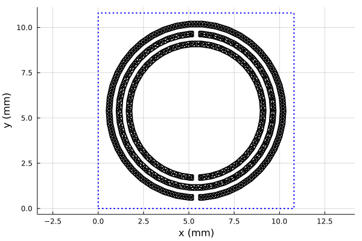

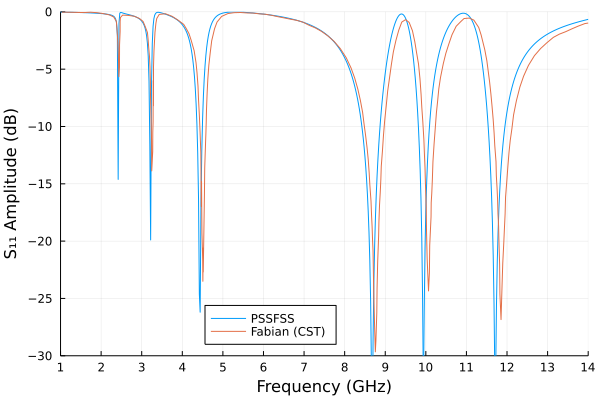

This run of 651 frequencies requires about 40 seconds on my machine.
Generally good agreement is seen between the PSSFSS predicted reflection amplitude and that
digitized from the paper. (The latter was obtained from a CST frequency domain analysis,
according to the paper's authors.) However, there is a small discrepancy in the predicted resonant
frequencies that increases
with frequency, likely because both results are less well converged at higher frequencies.
Also, the reflection amplitudes of the higher-frequency peaks are less than unity for the CST
results, possibly because the authors may have included the finite conductivity of the metal traces.
This detail was not reported in the paper.

```@meta
EditURL = "../literate/reflectarray_example.jl"
```

## Reflectarray Element
This example is taken from [li2009novel; Figure 6](@cite).
It generates the so-called "S-curve" for reflection phase of a reflectarray element. The element
consists of a square patch in a square ring, separated from a ground plane by two dielectric layers.
Reflection phase is plotted versus the `L2` parameter as defined in [li2009novel](@cite), which characterizes the
overall size of the element.

We start by defining a convenience function to generate a `RWGSheet` for a given value of `L2` in mm and
desired number of triangles `ntri`:

````@example reflectarray_example
function element(L2, ntri::Int)
    L = 17 # Period of square lattice (mm)
    k1 = 0.5
    k2 = 0.125
    L1 = k1 * L2
    w = k2 * L2
    a = [-1.0, (L2-2w)/√2]
    b = [L1/√2, L2/√2]
    return polyring(; sides=4, s1=[L, 0], s2=[0, L], ntri, orient=45, a, b, units=mm)
end
````

Here is a plot of the two elements at the size extremes to be examined:

````@example reflectarray_example
using PSSFSS, Plots
p1 = plot(element(2, 675), title="L2 = 2mm", unitcell=true, linecolor=:red)
p2 = plot(element(16.5, 3416), title="L2 = 16.5mm", unitcell=true, linecolor=:red)
p = plot(p1,p2)
savefig(p, "reflectarray_elements.png"); nothing  # hide
````


Here is the script that generates the S-curve.  To ensure accurate phases, a convergence check
is performed for each distinct `L2` value.  The number of triangles is increased by a factor of 1.5
if the previous increase resulted in a reflection phase change of more than one degree.  After
computing the phases, comparison is made to the same data computed by Li, et al from Ansoft HFSS and
CST Microwave Studio, and displayed in their Figure 6.

Note that the `width` for the first `Layer` is set to `-7mm`.  This has the effect of referring
reflection phases to the location of the ground plane, as was apparently done by Li, et al.  Also
note that the `unwrap!` function of the `DSP` package is used to "unwrap" phases to remove any
possible discontinuous jumps of 360 degrees.

```Julia
using PSSFSS
using Plots, DelimitedFiles
using DSP: unwrap!

p = plot(title="Reflection Phase Convergence", xlim=(2,18),ylim=(-350,150),xtick=2:2:18,ytick=-350:50:150,
         xlabel="Large Square Dimension L2 (mm)", ylabel="Reflecton Phase (deg)", legend=:topright)

FGHz = 10.0
L2s = range(2.0, 16.5, length=30)
nfactor = 1.5 # Growth factor for ntri
phasetol = 1.0 # Phase convergence tolerance
record = Tuple{Float64, Int, Int}[] # Storage for (L2,ntri,facecount(sheet))
phases = zeros(length(L2s))
ntri = 300
for (il2, L2) in pairs(L2s)
    print("L2 = $L2; ntri =")
    if il2 > 1
        global ntri = round(Int, ntri / (nfactor*nfactor))
    end
    oldphase = Inf
    firstrun = true
    while true
        ntri = round(Int, nfactor * ntri)
        if firstrun
            print(" $ntri")
            firstrun = false
        else
            print(", $ntri")
        end
        sheet = element(L2, ntri)
        strata = [Layer(width=-7mm)
                  sheet
                  Layer(ϵᵣ=2.65, width=1mm)
                  Layer(ϵᵣ=1.07, width=6mm)
                  pecsheet() # ground plane
                  Layer()]
        results = analyze(strata, FGHz, (ϕ=0, θ=0), showprogress=false, logfile="li2009.log", resultfile="li2009.res")
        phase = extract_result(results, @outputs s11ang(h,h))[1,1]
        phase < 0 && (phase += 360)
        Δphase = abs(phase - oldphase)
        if Δphase > phasetol
            oldphase = phase
        else
            phases[il2] = phase
            push!(record, (L2, ntri, facecount(sheet)))
            println("; Δphase = $(round(Δphase, digits=2))°")
            break
        end
    end
end

unwrap!(phases, range=360)
p = plot(title="Li 2009 Reflectarray", xlim=(2,18),ylim=(-350,150),xtick=2:2:18,ytick=-350:50:150,
    xminorticks=2, yminorticks=2,
    xlabel="Large Square Dimension L2 (mm)", ylabel="Reflecton Phase (deg)", legend=:topright)
plot!(p, L2s, phases, label="PSSFSS", color=:red, mscolor=:red, ms=3, shape=:circ)
dat = readdlm("li2009_ansoft_digitized.csv",  ',')
scatter!(p, dat[:,1], dat[:,2], label="Li Ansoft", mc=:blue, msc=:blue, markershape=:square)
dat = readdlm("li2009_cst_digitized.csv",  ',')
scatter!(p, dat[:,1], dat[:,2], label="Li CST", mc=:green, msc=:green, markershape=:circle)
display(p)
println()
record
```

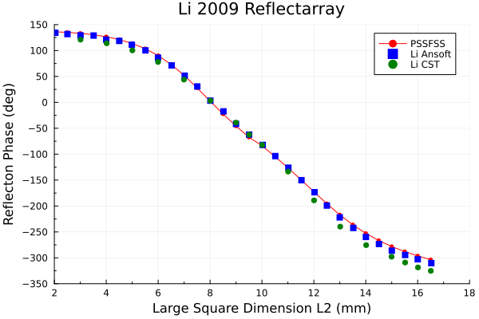

It can be seen that the PSSFSS phases compare well with the HFSS phases, better than the CST and HFSS phases compare
to each other.  The authors of the paper do not discuss checking the convergence of their results or even any details of
how they set up their HFSS and CST models.

The console output from the above script is shown below:
```Julia
julia> include("li2009_convergence.jl")

L2 = 2.0; ntri = 450, 675; Δphase = 0.02°
L2 = 2.5; ntri = 450, 675; Δphase = 0.04°
L2 = 3.0; ntri = 450, 675; Δphase = 0.06°
L2 = 3.5; ntri = 450, 675; Δphase = 0.1°
L2 = 4.0; ntri = 450, 675; Δphase = 0.14°
L2 = 4.5; ntri = 450, 675; Δphase = 0.18°
L2 = 5.0; ntri = 450, 675; Δphase = 0.19°
L2 = 5.5; ntri = 450, 675; Δphase = 0.15°
L2 = 6.0; ntri = 450, 675; Δphase = 0.02°
L2 = 6.5; ntri = 450, 675; Δphase = 0.41°
L2 = 7.0; ntri = 450, 675, 1012; Δphase = 0.12°
L2 = 7.5; ntri = 675, 1012; Δphase = 0.23°
L2 = 8.0; ntri = 675, 1012; Δphase = 0.38°
L2 = 8.5; ntri = 675, 1012; Δphase = 0.55°
L2 = 9.0; ntri = 675, 1012; Δphase = 0.73°
L2 = 9.5; ntri = 675, 1012; Δphase = 0.93°
L2 = 10.0; ntri = 675, 1012, 1518, 2277, 3416; Δphase = 0.67°
L2 = 10.5; ntri = 2277, 3416; Δphase = 0.54°
L2 = 11.0; ntri = 2277, 3416; Δphase = 0.35°
L2 = 11.5; ntri = 2277, 3416; Δphase = 0.1°
L2 = 12.0; ntri = 2277, 3416; Δphase = 0.17°
L2 = 12.5; ntri = 2277, 3416; Δphase = 0.41°
L2 = 13.0; ntri = 2277, 3416; Δphase = 0.59°
L2 = 13.5; ntri = 2277, 3416; Δphase = 0.69°
L2 = 14.0; ntri = 2277, 3416; Δphase = 0.73°
L2 = 14.5; ntri = 2277, 3416; Δphase = 0.72°
L2 = 15.0; ntri = 2277, 3416; Δphase = 0.69°
L2 = 15.5; ntri = 2277, 3416; Δphase = 0.65°
L2 = 16.0; ntri = 2277, 3416; Δphase = 0.61°
L2 = 16.5; ntri = 2277, 3416; Δphase = 0.59°

30-element Vector{Tuple{Float64, Int64, Int64}}:
 (2.0, 675, 722)
 (2.5, 675, 722)
 (3.0, 675, 722)
 (3.5, 675, 722)
 (4.0, 675, 722)
 (4.5, 675, 722)
 (5.0, 675, 722)
 (5.5, 675, 722)
 (6.0, 675, 722)
 (6.5, 675, 722)
 (7.0, 1012, 944)
 (7.5, 1012, 944)
 (8.0, 1012, 944)
 (8.5, 1012, 944)
 (9.0, 1012, 944)
 (9.5, 1012, 944)
 (10.0, 3416, 3314)
 (10.5, 3416, 3314)
 (11.0, 3416, 3314)
 (11.5, 3416, 3314)
 (12.0, 3416, 3314)
 (12.5, 3416, 3314)
 (13.0, 3416, 3314)
 (13.5, 3416, 3314)
 (14.0, 3416, 3314)
 (14.5, 3416, 3314)
 (15.0, 3416, 3314)
 (15.5, 3416, 3314)
 (16.0, 3416, 3314)
 (16.5, 3416, 3314)
```

The first list shows how the script increases the number of triangles requested for each geometry
until the reflection phase is sufficiently converged.  The printout of the `record` array shows
both the final requested value of `ntri` and actual number of triangle faces generated by the mesher for each
`L2` value.  The final cases with `ntri=3416` required about 21 seconds each of execution time.

```@meta
EditURL = "../literate/band_pass_filter.jl"
```

## Loaded Cross Band Pass Filter
This example is originally from [munk2000fss; Fig. 7.9](@cite).
The same case was analyzed in [li2006model](@cite).  Unfortunately, in neither reference
are the dimensions of the loaded cross stated, except for the square unit cell
period of 8.61 mm.  I estimated the dimensions from the sketch in Fig. 6 of the second
reference.  To provide a reliable comparison, I analyzed one-eighth of the structure
in HFSS, a commercial finite element solver, using all three planes of symmetry.
Exploiting the symmetry in the z = constant centerline plane
required two analyses, once for an H-wall boundary condition, and once for an E-wall. Those
results were then combined using the method of Reed and Wheeler [reed1956method](@cite), i.e.
using even/odd symmetry. With a much reduced computational domain, it was then possible to
drive HFSS well into convergence.

Two identical loaded cross slot-type elements are separated by a 6 mm layer of dielectric
constant 1.9.  Outboard of each sheet is a 1.1 cm layer of dielectric constant 1.3.
The closely spaced sheets are a good test of the generalized scattering formulation
implemented in PSSFSS.  The sheet geometry is shown below.  Remember that the entire
sheet is metalized *except* for the region of the triangulation.

````@example band_pass_filter
using Plots, PSSFSS
sheet = loadedcross(class='M', w=0.023, L1=0.8, L2=0.14,
            s1=[0.861,0.0], s2=[0.0,0.861], ntri=2400, units=cm)
plot(sheet, linecolor=:red, unitcell=true)
savefig("bpf1.png"); nothing  # hide
````


````@example band_pass_filter
steering = (ϕ=0, θ=0)
strata = [  Layer()
            Layer(ϵᵣ=1.3, width=1.1cm)
            sheet
            Layer(ϵᵣ=1.9, width=0.6cm)
            sheet
            Layer(ϵᵣ=1.3, width=1.1cm)
            Layer()  ]
flist = 1:0.1:20
results = analyze(strata, flist, steering, resultfile=devnull,
                  logfile=devnull, showprogress=false)
data = extract_result(results, @outputs FGHz s21db(v,v) s11db(v,v))
using DelimitedFiles
dat = readdlm("../src/assets/hfss_loadedcross_bpf_full.csv", ',', skipstart=1)
p = plot(xlabel="Frequency (GHz)", ylabel="Reflection Coefficient (dB)",
         legend=:left, title="Loaded Cross Band-Pass Filter", xtick=0:2:20, ytick=-30:5:0,
         xlim=(-0.1,20.1), ylim=(-35,0.1))
plot!(p, data[:,1], data[:,3], label="PSSFSS", color=:red)
plot!(p, dat[:,1], dat[:,2], label="HFSS", color=:blue)
savefig("bpf2.png"); nothing  # hide
````


````@example band_pass_filter
p2 = plot(xlabel="Frequency (GHz)", ylabel="Transmission Coefficient (dB)",
          legend=:bottom, title="Loaded Cross Band-Pass Filter", xtick=0:2:20, ytick=-80:10:0,
         xlim=(-0.1,20.1), ylim=(-80,0.1))
plot!(p2, data[:,1], data[:,2], label="PSSFSS", color=:red)
plot!(p2, dat[:,1], dat[:,4], label="HFSS", color=:blue)
savefig("bpf3.png"); nothing  # hide
````


This analysis takes about 173 seconds for 191 frequencies on my machine. The number
of triangles requested is a compromise between accuracy and speed.  Even better agreement
with the HFSS result would be possible with more triangles, at the cost of execution time.
Note that rather than including two separate invocations of the `loadedcross` function when
defining the strata, I referenced the same sheet object in the two different locations.
This allows PSSFSS to recognize that the triangulations are identical, and to exploit
this fact in making the analysis more efficient.  In fact, if both sheets had been embedded
in similar dielectric claddings (in the same order), then the GSM (generalized scattering matrix)
computed for the sheet in its first location could be reused without additional computation for its
second location.  In this case, though, only the spatial integrals are re-used.  For an oblique
incidence case, computing the spatial integrals is often the most expensive part of the analysis,
so the savings from reusing the same sheet definition can be substantial.

### Conclusion
Very good agreement is obtained versus HFSS over a large dynamic range of almost 80 dB, and over a 20:1
frequency bandwidth.

```@meta
EditURL = "../literate/cpss1.jl"
```

## Meanderline-Based CPSS
A "CPSS" is a circular polarization selective structure, i.e., a structure that reacts differently
to the two senses of circular polarization.
We'll first look at analyzing a design presented in the literature, and then proceed to optimize another
design using PSSFSS as the analysis engine inside the optimization objective function.
### Sjöberg and Ericsson Design
This example comes from [sjoberg2014multi](@cite).
The authors describe an ingenious structure consisting of 5 progressively rotated meanderline sheets, which
acts as a circular polarization selective surface: it passes LHCP (almost) without attenuation or
reflection, and reflects RHCP (without changing its sense!) almost without attenuation or transmission.

Here is the script that analyzes their design:

````@example cpss1
using PSSFSS
# Define convenience functions for sheets:
outer(rot) = meander(a=3.97, b=3.97, w1=0.13, w2=0.13, h=2.53+0.13, units=mm, ntri=600, rot=rot)
inner(rot) = meander(a=3.97*√2, b=3.97/√2, w1=0.1, w2=0.1, h=0.14+0.1, units=mm, ntri=600, rot=rot)
center(rot) = meander(a=3.97, b=3.97, w1=0.34, w2=0.34, h=2.51+0.34, units=mm, ntri=600, rot=rot)
# Note our definition of `h` differs from that of the reference by the width of the strip.
t1 = 4mm # Outer layers thickness
t2 = 2.45mm # Inner layers thickness
substrate = Layer(width=0.1mm, epsr=2.6)
foam(w) = Layer(width=w, epsr=1.05) # Foam layer convenience function
rot0 = 0 # rotation of first sheet
strata = [
    Layer()
    outer(rot0)
    substrate
    foam(t1)
    inner(rot0 - 45)
    substrate
    foam(t2)
    center(rot0 - 2*45)
    substrate
    foam(t2)
    inner(rot0 - 3*45)
    substrate
    foam(t1)
    outer(rot0 - 4*45)
    substrate
    Layer() ]
steering = (θ=0, ϕ=0)
flist = 10:0.1:20
#
results = analyze(strata, flist, steering, showprogress=false,
                  resultfile=devnull, logfile=devnull);
nothing #hide
````

Here are plots of the five meanderline sheets:

````@example cpss1
using Plots
plot(outer(rot0), unitcell=true, title="Sheet1")
````

````@example cpss1
plot(inner(rot0-45), unitcell=true, title="Sheet2")
````

````@example cpss1
plot(center(rot0-2*45), unitcell=true, title="Sheet3 (Center)")
````

````@example cpss1
plot(inner(rot0-3*45), unitcell=true, title="Sheet4")
````

````@example cpss1
plot(outer(rot0-4*45), unitcell=true, title="Sheet5")
````

Notice that not only are the meanders rotated, but so too are the unit cell rectangles.
This is because we used the generic `rot` keyword argument that rotates the entire unit
cell and its contents. `rot` can be used for any FSS or PSS element type.  As a consequence of
the different rotations applied to each unit cell, interactions between sheets due to higher-order
modes cannot be accounted for; only the dominant ``m=n=0`` TE and TM modes are used in cascading
the individual sheet scattering matrices.  This approximation is adequate for sheets that are
sufficiently separated.  We can see from the log file (saved from a previous run where it was not
disabled) that only 2 modes are used to model the interactions between sheets:

```
Starting PSSFSS 1.0.0 analysis on 2022-09-12 at 16:35:20.914
Julia Version 1.8.1
Commit afb6c60d69 (2022-09-06 15:09 UTC)
Platform Info:
  OS: Windows (x86_64-w64-mingw32)
  CPU: 8 × Intel(R) Core(TM) i7-9700 CPU @ 3.00GHz
  WORD_SIZE: 64
  LIBM: libopenlibm
  LLVM: libLLVM-13.0.1 (ORCJIT, skylake)
  Threads: 8 on 8 virtual cores
  BLAS: LBTConfig([ILP64] libopenblas64_.dll)


******************* Warning ***********************
   Unequal unit cells in sheets 1 and 2
   Setting #modes in dividing layer 3 to 2
******************* Warning ***********************


******************* Warning ***********************
   Unequal unit cells in sheets 2 and 3
   Setting #modes in dividing layer 5 to 2
******************* Warning ***********************


******************* Warning ***********************
   Unequal unit cells in sheets 3 and 4
   Setting #modes in dividing layer 7 to 2
******************* Warning ***********************


******************* Warning ***********************
   Unequal unit cells in sheets 4 and 5
   Setting #modes in dividing layer 9 to 2
******************* Warning ***********************


Dielectric layer information...

 Layer  Width  units  epsr   tandel   mur  mtandel modes  beta1x  beta1y  beta2x  beta2y
 ----- ------------- ------- ------ ------- ------ ----- ------- ------- ------- -------
     1    0.0000  mm    1.00 0.0000    1.00 0.0000     2  1582.7    -0.0    -0.0  1582.7
 ==================  Sheet   1  ========================  1582.7    -0.0    -0.0  1582.7
     2    0.1000  mm    2.60 0.0000    1.00 0.0000     0     0.0     0.0     0.0     0.0
     3    4.0000  mm    1.05 0.0000    1.00 0.0000     2  1582.7    -0.0    -0.0  1582.7
 ==================  Sheet   2  ========================   791.3  -791.3  1582.7  1582.7
     4    0.1000  mm    2.60 0.0000    1.00 0.0000     0     0.0     0.0     0.0     0.0
     5    2.4500  mm    1.05 0.0000    1.00 0.0000     2   791.3  -791.3  1582.7  1582.7
 ==================  Sheet   3  ========================     0.0 -1582.7  1582.7     0.0
     6    0.1000  mm    2.60 0.0000    1.00 0.0000     0     0.0     0.0     0.0     0.0
     7    2.4500  mm    1.05 0.0000    1.00 0.0000     2     0.0 -1582.7  1582.7     0.0
 ==================  Sheet   4  ========================  -791.3  -791.3  1582.7 -1582.7
     8    0.1000  mm    2.60 0.0000    1.00 0.0000     0     0.0     0.0     0.0     0.0
     9    4.0000  mm    1.05 0.0000    1.00 0.0000     2  -791.3  -791.3  1582.7 -1582.7
 ==================  Sheet   5  ======================== -1582.7     0.0     0.0 -1582.7
    10    0.1000  mm    2.60 0.0000    1.00 0.0000     0     0.0     0.0     0.0     0.0
    11    0.0000  mm    1.00 0.0000    1.00 0.0000     2 -1582.7     0.0     0.0 -1582.7

...
```

Note that PSSFSS prints warnings to the log file where it is forced to set the number of layer
modes to 2 because of unequal unit cells.  Also, in the dielectric layer list it can be seen
that these layers are assigned 2 modes each.  The thin layers adjacent to sheets are assigned 0
modes because these sheets are incorporated into so-called "GSM blocks" or "Gblocks" wherein
the presence of the thin layer is accounted for using the stratified medium Green's functions.
Analyzing this multilayer structure at 101 frequencies required about 22 seconds on my machine.

Here is the script that compares PSSFSS predicted performance with very
high accuracy predictions from CST and COMSOL that were digitized from figures in the paper.

````@example cpss1
using Plots, DelimitedFiles
RL11rr = -extract_result(results, @outputs s11db(r,r))
AR11r = extract_result(results, @outputs ar11db(r))
IL21L = -extract_result(results, @outputs s21db(L,L))
AR21L = extract_result(results, @outputs ar21db(L))

RLgoal, ILgoal, ARgoal  = ([0.5, 0.5], [0.5, 0.5], [0.75, 0.75])
foptlimits = [12, 18]
default(lw=2, xtick=10:20, xlabel="Frequency (GHz)", ylabel="Amplitude (dB)", gridalpha=0.3)

p = plot(flist,RL11rr,title="RHCP → RHCP Return Loss", label="PSSFSS",
         ylim=(0,2), ytick=0:0.25:2)
cst = readdlm("../src/assets/cpss_cst_fine_digitized_rl.csv", ',')
plot!(p, cst[:,1], cst[:,2], label="CST")
comsol = readdlm("../src/assets/cpss_comsol_fine_digitized_rl.csv", ',')
plot!(p, comsol[:,1], comsol[:,2], label="COMSOL")
plot!(p, foptlimits, RLgoal, color=:black, lw=4, label="Goal")
savefig("cpssa1.png"); nothing  # hide
````


````@example cpss1
p = plot(flist,AR11r,title="RHCP → RHCP Reflected Axial Ratio", label="PSSFSS",
         xlim=(10,20), ylim=(0,3), ytick=0:0.5:3)
cst = readdlm("../src/assets/cpss_cst_fine_digitized_ar_reflected.csv", ',')
plot!(p, cst[:,1], cst[:,2], label="CST")
comsol = readdlm("../src/assets/cpss_comsol_fine_digitized_ar_reflected.csv", ',')
plot!(p, comsol[:,1], comsol[:,2], label="COMSOL")
plot!(p, foptlimits, ARgoal, color=:black, lw=4, label="Goal")
savefig("cpssa2.png"); nothing  # hide
````


````@example cpss1
p = plot(flist,IL21L,title="LHCP → LHCP Insertion Loss", label="PSSFSS",
         xlim=(10,20), ylim=(0,2), ytick=0:0.25:2)
cst = readdlm("../src/assets/cpss_cst_fine_digitized_il.csv", ',')
plot!(p, cst[:,1], cst[:,2], label="CST")
comsol = readdlm("../src/assets/cpss_comsol_fine_digitized_il.csv", ',')
plot!(p, comsol[:,1], comsol[:,2], label="COMSOL")
plot!(p, foptlimits, ILgoal, color=:black, lw=4, label="Goal")
savefig("cpssa3.png"); nothing  # hide
````


````@example cpss1
p = plot(flist,AR21L,title="LHCP → LHCP Transmitted Axial Ratio", label="PSSFSS",
         xlim=(10,20), ylim=(0,3), ytick=0:0.5:3)
cst = readdlm("../src/assets/cpss_cst_fine_digitized_ar_transmitted.csv", ',')
plot!(p, cst[:,1], cst[:,2], label="CST")
comsol = readdlm("../src/assets/cpss_comsol_fine_digitized_ar_transmitted.csv", ',')
plot!(p, comsol[:,1], comsol[:,2], label="COMSOL")
plot!(p, foptlimits, ARgoal, color=:black, lw=4, label="Goal")
savefig("cpssa4.png"); nothing  # hide
````


The PSSFSS results generally track well with the high-accuracy solutions, but are less accurate
especially at the high end of the band, possibly because in PSSFSS metallization thickness is
neglected and cascading is performed for this structure using only the two principal Floquet modes.
As previosly discussed, this is necessary because the rotated meanderlines are achieved by rotating
the entire unit cell, and the unit cell for sheets 2 and 4 are not square.  Since the periodicity of
the sheets in the structure varies from sheet to sheet, higher order Floquet modes common to neighboring
sheets cannot be defined, so we are forced to use only the dominant (0,0) modes which are independent of
the periodicity.  This limitation is removed in the next example.
Meanwhile, it is of interest to note that their high-accuracy runs
required 10 hours for CST and 19 hours for COMSOL on large engineering workstations versus about 22
seconds for PSSFSS on my desktop machine.

```@meta
EditURL = "../literate/cpss_optimization.jl"
```

## CPSS Optimization
Here we design a CPSS (circular polarization selective structure) similar to the previous example
using PSSFSS in conjunction with the CMAES optimizer from the
[CMAEvolutionStrategy](https://github.com/jbrea/CMAEvolutionStrategy.jl) package.  I've used CMAES
in the past with good success on some tough optimization problems.  Here is the code that defines
the objective function:

```julia
using PSSFSS
using Dates: now

let bestf = typemax(Float64)
    global objective
    """
        result = objective(x)

    """
    function objective(x)
        ao, bo, ai, bi, ac, bc, wo, ho, wi, hi, wc, hc, t1, t2 = x
        (bo > ho > 2.1*wo && bi > hi > 2.1*wi && bc > hc > 2.1*wc) || (return 5000.0)

        outer(rot) = meander(a=ao, b=bo, w1=wo, w2=wo, h=ho, units=mm, ntri=400, rot=rot)
        inner(rot) = meander(a=ai, b=bi, w1=wi, w2=wi, h=hi, units=mm, ntri=400, rot=rot)
        center(rot) = meander(a=ac, b=bc, w1=wc, w2=wc, h=hc, units=mm, ntri=400, rot=rot)

        substrate = Layer(width=0.1mm, epsr=2.6)
        foam(w) = Layer(width=w, epsr=1.05)
        rot0 = 0

        strata = [
                Layer()
                outer(rot0)
                substrate
                foam(t1*1mm)
                inner(rot0 - 45)
                substrate
                foam(t2*1mm)
                center(rot0 - 2*45)
                substrate
                foam(t2*1mm)
                inner(rot0 - 3*45)
                substrate
                foam(t1*1mm)
                outer(rot0 - 4*45)
                substrate
                Layer() ]
        steering = (θ=0, ϕ=0)
        flist = 11.5:0.25:18.5
        resultfile = logfile = devnull
        showprogress = false
        results = analyze(strata, flist, steering; showprogress, resultfile, logfile)
        s11rr, s21ll, ar11db, ar21db = eachcol(extract_result(results,
                       @outputs s11db(R,R) s21db(L,L) ar11db(R) ar21db(L)))
        RL = -s11rr
        IL = -s21ll
        RLgoal, ILgoal, ARgoal  = (0.4, 0.5, 0.6)
        obj = max(maximum(RL) - RLgoal,
                  maximum(IL) - ILgoal,
                  maximum(ar11db) - ARgoal,
                  maximum(ar21db) - ARgoal)
        if obj < bestf
            bestf = obj
            open("optimization_best.log", "a") do fid
                xround = map(t  -> round(t, digits=4), x)
                println(fid, round(obj,digits=5), " at x = ", xround, "  #", now())
            end
        end
        return obj
    end
end
```

We optimize at 29 frequencies between 11.5 and 18.5 GHz.  In the previously presented
Sjöberg and Ericsson design a smaller frequency range of 12 to 18 GHz was used for optimization.
We have also adopted more ambitious goals for return loss, insertion loss, and axial ratio
of 0.4 dB, 0.5 dB, and 0.6 dB, respectively. These should be feasible because for
our optimization setup, we have relaxed the restriction that all unit cells must be
identical squares.  With more "knobs to turn" (i.e., a larger search space), we expect to be able
to do somewhat better in terms of bandwidth and worst-case performance.  For our setup there are
fourteen optimization variables in all.
As one can see from the code above, each successive sheet in the structure is rotated an additional
45 degrees relative to its predecessor.   The objective is defined as the maximum departure
from the goal of RHCP reflected return loss, LHCP insertion loss, or reflected or transmitted axial ratio that
occurs at any of the analysis frequencies (i.e. we are setting up for "minimax" optimization). Also,
the `let` block allows the objective function to maintain persistent state in the
variable `bestf` which is initialized to the largest 64-bit floating point value. Each time a set
of inputs results in a lower objective function value, `bestf` is updated with this value and
the inputs and objective function value are
written to the file "optimization_best.log", along with a date/time stamp.  This allows the user
to monitor the optimization and to terminate the it prematurely, if desired, without losing the
best result achieved so far. Each objective function evaluation takes about 4.5 seconds on my machine.

Here is the code for running the optimization:

```julia
using CMAEvolutionStrategy
#  x = [a1,  b1,   a2, b2,  a3,  b3,  wo,  ho,  wi,   hi,  wc,   hc,  t1,  t2]
xmin = [3.0, 3.0, 3.0, 3.0, 3.0, 3.0, 0.1, 0.1, 0.1,  0.1, 0.1,  0.1, 2.0, 2.0]
xmax = [5.0, 5.0, 5.0, 5.0, 5.0, 5.0, 0.35,4.0, 0.35, 4.0, 0.35, 4.0, 6.0, 6.0]
x0 = 0.5 * (xmin + xmax)
isfile("optimization_best.log") && rm("optimization_best.log")
popsize = 2*(4 + floor(Int, 3*log(length(x0))))
opt = minimize(objective, x0, 1.0;
           lower = xmin,
           upper = xmax,
           maxfevals = 9000,
           popsize = popsize,
           xtol = 1e-4,
           ftol = 1e-6)
```

Note that I set the population size to twice the normal default value.  Based
on previous experience, using 2 to 3 times the default population size helps the
optimizer to do better on tough objective functions like the present one.
The optimizer finished after about 12 hours, having used up its budget of 9000 objective function
evaluations. During this time it reduced the objective function
value from 35.75 dB to -0.14 dB.

Here are the first and last few lines of the file "optimization_best.log" created during the optimization run:
```
35.74591 at x = [3.0822, 3.851, 3.0639, 3.1239, 3.7074, 3.1435, 0.3477, 2.4549, 0.1816, 2.9164, 0.335, 1.9599, 4.6263, 3.8668]  #2022-09-20T17:58:29.168
34.98097 at x = [4.1331, 3.9279, 3.3677, 3.4181, 3.0029, 4.5767, 0.2332, 1.3751, 0.1181, 3.2087, 0.3212, 1.7239, 3.7246, 3.7646]  #2022-09-20T17:58:35.329
21.45525 at x = [3.0427, 3.1525, 4.2728, 4.8541, 4.1922, 3.426, 0.102, 1.1193, 0.35, 2.0465, 0.1142, 1.9158, 3.4733, 4.0413]  #2022-09-20T17:58:45.925
13.85918 at x = [4.2285, 4.3504, 3.873, 4.3875, 3.7093, 3.8152, 0.118, 2.1575, 0.31, 3.5789, 0.3475, 3.0538, 5.5819, 2.9443]  #2022-09-20T17:59:45.984
7.71171 at x = [3.3824, 3.7428, 4.0395, 3.0979, 4.4467, 3.6702, 0.1304, 0.8826, 0.2323, 1.8111, 0.1534, 2.5018, 4.4872, 2.8612]  #2022-09-20T17:59:56.203
7.34573 at x = [4.2534, 4.7094, 4.0162, 3.3676, 3.2118, 4.4815, 0.1251, 2.6005, 0.3312, 1.5494, 0.3153, 1.5827, 2.0242, 4.181]  #2022-09-20T18:00:00.968
3.07587 at x = [4.9501, 4.6063, 4.9145, 4.6475, 4.3812, 3.1389, 0.1147, 2.2538, 0.3489, 2.1218, 0.1052, 0.8864, 3.6838, 3.4847]  #2022-09-20T18:00:12.513
3.05626 at x = [4.2391, 4.9991, 4.4545, 4.3303, 3.8393, 3.4906, 0.1207, 1.4096, 0.1421, 2.5086, 0.3435, 1.3212, 3.1339, 2.7907]  #2022-09-20T18:01:51.282
2.41192 at x = [3.7758, 4.9686, 4.0366, 4.5324, 4.2108, 3.9565, 0.1304, 2.0133, 0.345, 0.753, 0.1746, 1.0458, 2.7633, 2.8851]  #2022-09-20T18:02:04.960
2.19734 at x = [3.5704, 3.3381, 4.8014, 3.9773, 4.95, 3.5487, 0.1265, 2.3151, 0.2854, 1.1389, 0.108, 1.4173, 3.8662, 2.5112]  #2022-09-20T18:02:59.465
...
-0.13539 at x = [3.1913, 4.8684, 3.5625, 3.0614, 3.5238, 3.1521, 0.3499, 2.8795, 0.3371, 1.2669, 0.2726, 2.3683, 3.9736, 2.3058]  #2022-09-21T05:32:23.953
-0.13572 at x = [3.2131, 4.8659, 3.5518, 3.0545, 3.5278, 3.1605, 0.35, 2.868, 0.3365, 1.2666, 0.2749, 2.3801, 3.9877, 2.2922]  #2022-09-21T05:32:34.131
-0.13595 at x = [3.2096, 4.8665, 3.5728, 3.0472, 3.4952, 3.1517, 0.35, 2.8719, 0.3369, 1.2747, 0.274, 2.3782, 3.983, 2.2889]  #2022-09-21T05:34:20.813
-0.13598 at x = [3.1954, 4.8681, 3.567, 3.0514, 3.4953, 3.1516, 0.35, 2.8779, 0.3366, 1.2694, 0.273, 2.3704, 3.9765, 2.2992]  #2022-09-21T05:35:16.363
-0.13599 at x = [3.1931, 4.862, 3.5728, 3.0501, 3.5085, 3.1609, 0.3499, 2.8702, 0.3366, 1.2717, 0.2757, 2.3794, 3.9833, 2.2925]  #2022-09-21T05:35:41.565
-0.13615 at x = [3.2057, 4.8631, 3.5908, 3.0483, 3.5005, 3.1543, 0.3498, 2.869, 0.3371, 1.2736, 0.2743, 2.3792, 3.9859, 2.2878]  #2022-09-21T05:36:42.633
-0.13664 at x = [3.177, 4.8596, 3.598, 3.0483, 3.4378, 3.1504, 0.3498, 2.8722, 0.3373, 1.2771, 0.2753, 2.3737, 3.9777, 2.291]  #2022-09-21T05:38:59.901
-0.13678 at x = [3.1939, 4.8634, 3.5887, 3.0558, 3.4491, 3.1507, 0.35, 2.8725, 0.3381, 1.2715, 0.2744, 2.3721, 3.9811, 2.2932]  #2022-09-21T05:43:47.228
-0.13692 at x = [3.1669, 4.8616, 3.6063, 3.0555, 3.4097, 3.1535, 0.35, 2.8759, 0.3369, 1.2722, 0.2765, 2.3676, 3.9739, 2.2998]  #2022-09-21T05:56:14.160
-0.13694 at x = [3.1666, 4.8568, 3.609, 3.053, 3.387, 3.1645, 0.35, 2.8688, 0.3368, 1.2743, 0.2806, 2.3778, 3.981, 2.2902]  #2022-09-21T05:57:50.537
-0.137 at x = [3.1638, 4.8589, 3.603, 3.0576, 3.3991, 3.1654, 0.35, 2.8714, 0.3365, 1.2687, 0.2796, 2.3729, 3.978, 2.2978]  #2022-09-21T05:58:19.459
-0.13701 at x = [3.1611, 4.859, 3.6064, 3.0629, 3.3962, 3.1529, 0.35, 2.8733, 0.3375, 1.2688, 0.2766, 2.3659, 3.9759, 2.3007]  #2022-09-21T05:58:34.762
-0.13712 at x = [3.1711, 4.86, 3.6049, 3.0547, 3.4055, 3.1535, 0.35, 2.8727, 0.3386, 1.2797, 0.2774, 2.3738, 3.9777, 2.2907]  #2022-09-21T06:01:01.374
-0.13717 at x = [3.1659, 4.8555, 3.6091, 3.0577, 3.3919, 3.1635, 0.35, 2.8698, 0.337, 1.2668, 0.2792, 2.3721, 3.9804, 2.2971]  #2022-09-21T06:10:03.148
-0.13759 at x = [3.1576, 4.8557, 3.605, 3.0616, 3.3655, 3.1612, 0.3499, 2.8687, 0.3368, 1.2662, 0.2796, 2.3696, 3.9802, 2.2976]  #2022-09-21T06:10:13.351
```

The final sheet geometries and performance of this design are shown below:

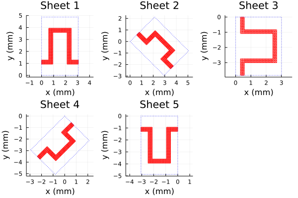

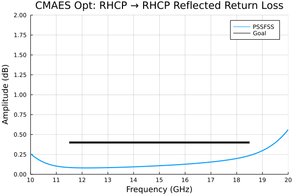

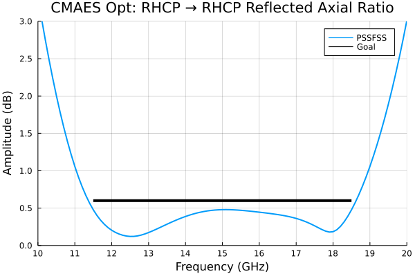

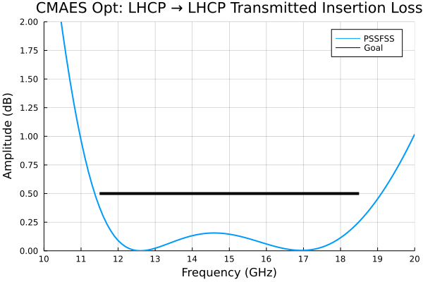

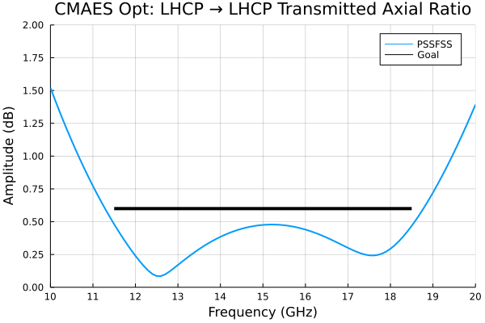

As hoped for, the performance meets the more stringent design goals over a broader bandwidth than the
Sjöberg and Ericsson design of [sjoberg2014multi](@cite), presumably because of the greater design flexibility allowed here.

```@meta
EditURL = "../literate/cpss2.jl"
```

## Meanderline/Strip-Based CPSS
This example comes from [ericsson2017design](@cite), by the same authors as the previous example.
The design is similar to that of the previous example except that here, the two ``\pm 45^\circ``
rotated meanderlines are replaced with rectangular strips.
This allows us to employ the `diagstrip` element and the `orient` keyword for the
`meander` elements to maintain the same, square unit cell for all sheets. By doing this
we allow PSSFSS to rigorously account for the inter-sheet coupling using multiple
high-order modes in the generalized scattering matrix (GSM) formulation.

We begin by computing the skin depth for the copper traces.  The conductivity and thickness
are as stated in the paper:

````@example cpss2
# Compute skin depth:
using PSSFSS.Constants: μ₀ # free-space permeability [H/m]
f = (10:0.1:20) * 1e9 # frequencies in Hz
σ = 58e6 # conductivity of metalization [S/m]
t = 18e-6 # metalization thickness [m]
Δ = sqrt.(2 ./ (2π*f*σ*μ₀)) # skin depth [m]
@show extrema(t./Δ)
````

We see that the metal is many skin depths thick (effectively infinitely thick) so that we
can safely use the thick metal surface sheet impedance formula from the
[MetalSurfaceImpedance](https://github.com/simonp0420/MetalSurfaceImpedance.jl) package that is
employed internally by PSSFSS.

Here is the script that analyzes the design from the referenced paper:

````@example cpss2
using PSSFSS
P = 5.2 # side length of unit cell square
d1 = 2.61 # Inner layer thickness
d2 = 3.81 # Outer layer thickness
h0 = 2.44 # Inner meanderline dimension (using paper's definition of h)
h2 = 2.83 # Outer meanderline dimension (using paper's definition of h)
w0x = 0.46 # Inner meanderline line thickness of traces running along x
w0y = 0.58 # Inner meanderline line thickness of traces running along y
w1 = 0.21 # Rectangular strips width
w2x = 0.25   # Outer meanderline line thickness of traces running along x
w2y = 0.17 # Outer meanderline line thickness of traces running along y
a = b = P
ntri = 600
units = mm
outer(orient) = meander(;a, b, w1=w2y, w2=w2x, h=h2+w2x, units, ntri, σ, orient=orient)
inner = meander(;a, b, w1=w0y, w2=w0x, h=h0+w0x, units, ntri, σ)
strip(orient) = diagstrip(;P, w=w1, units, Nl=60, Nw=4, orient=orient, σ)

substrate = Layer(width=0.127mm, epsr=2.17, tandel=0.0009)
foam(w) = Layer(width=w, epsr=1.043, tandel=0.0017)
sheets = [outer(-90), strip(-45), inner, strip(45), outer(90)]
strata = [
    Layer()
    substrate
    sheets[1]
    foam(d2 * 1mm)
    substrate
    sheets[2]
    foam(d1 * 1mm)
    sheets[3]
    substrate
    foam(d1 * 1mm)
    substrate
    sheets[4]
    foam(d2 * 1mm)
    sheets[5]
    substrate
    Layer() ]
steering = (θ=0, ϕ=0)
flist = 10:0.1:20

results = analyze(strata, flist, steering, logfile=devnull,
                  resultfile=devnull, showprogress=false)
nothing # hide
````

The PSSFSS run of this 5-sheet structure at 101 frequencies required only 13 seconds on my machine.
Here are plots of the five sheets:

````@example cpss2
using Plots
default()
ps = []
for k in 1:5
    push!(ps, plot(sheets[k], unitcell=true, title="Sheet $k", linecolor=:red))
end
plot(ps..., layout=5)
savefig("cpssb1.png"); nothing  # hide
````


Notice that for all 5 sheets, the unit cell is a square of constant side length and is unrotated.
We can see from the log file (of a previous run where it was not suppressed) that this allows
PSSFSS to use additional modes in the GSM cascading procedure:

```
Starting PSSFSS 1.2.1 analysis on 2022-11-30 at 09:30:18.299
Julia Version 1.8.2
Commit 36034abf26 (2022-09-29 15:21 UTC)
Platform Info:
  OS: Windows (x86_64-w64-mingw32)
  CPU: 8 × Intel(R) Core(TM) i7-9700 CPU @ 3.00GHz
  WORD_SIZE: 64
  LIBM: libopenlibm
  LLVM: libLLVM-13.0.1 (ORCJIT, skylake)
  Threads: 8 on 8 virtual cores
  BLAS: LBTConfig([ILP64] libopenblas64_.dll)


Dielectric layer information...

 Layer  Width  units  epsr   tandel   mur  mtandel modes  beta1x  beta1y  beta2x  beta2y
 ----- ------------- ------- ------ ------- ------ ----- ------- ------- ------- -------
     1    0.0000  mm    1.00 0.0000    1.00 0.0000     2  1208.3    -0.0    -0.0  1208.3
     2    0.1270  mm    2.17 0.0009    1.00 0.0000     0     0.0     0.0     0.0     0.0
 ==================  Sheet   1  ========================  1208.3    -0.0    -0.0  1208.3
     3    3.8100  mm    1.04 0.0017    1.00 0.0000    10  1208.3    -0.0    -0.0  1208.3
     4    0.1270  mm    2.17 0.0009    1.00 0.0000     0     0.0     0.0     0.0     0.0
 ==================  Sheet   2  ========================  1208.3    -0.0    -0.0  1208.3
     5    2.6100  mm    1.04 0.0017    1.00 0.0000    18  1208.3    -0.0    -0.0  1208.3
 ==================  Sheet   3  ========================  1208.3    -0.0    -0.0  1208.3
     6    0.1270  mm    2.17 0.0009    1.00 0.0000     0     0.0     0.0     0.0     0.0
     7    2.6100  mm    1.04 0.0017    1.00 0.0000    18  1208.3    -0.0    -0.0  1208.3
     8    0.1270  mm    2.17 0.0009    1.00 0.0000     0     0.0     0.0     0.0     0.0
 ==================  Sheet   4  ========================  1208.3    -0.0    -0.0  1208.3
     9    3.8100  mm    1.04 0.0017    1.00 0.0000    10  1208.3    -0.0    -0.0  1208.3
 ==================  Sheet   5  ========================  1208.3    -0.0    -0.0  1208.3
    10    0.1270  mm    2.17 0.0009    1.00 0.0000     0     0.0     0.0     0.0     0.0
    11    0.0000  mm    1.00 0.0000    1.00 0.0000     2  1208.3    -0.0    -0.0  1208.3

...
```

Layers 3 and 9 were assigned 10 modes each.  Layers 5 and 7, being thinner, were assigned
18 modes each. The numbers of modes are determined automatically by PSSFSS to ensure
accurate cascading.

Here are comparison plots of PSSFSS versus highly converged CST predictions digitized from
plots presented in the paper:

````@example cpss2
using Plots, DelimitedFiles
RLl = -extract_result(results, @outputs s11db(l,l))
AR11l = extract_result(results, @outputs ar11db(l))
IL21r = -extract_result(results, @outputs s21db(r,r))
AR21r = extract_result(results, @outputs ar21db(r))

default(lw=2, xlabel="Frequency (GHz)", xlim=(10,20), xtick=10:2:20,
        framestyle=:box, gridalpha=0.3)

plot(flist,RLl,title="LHCP → LHCP Return Loss", label="PSSFSS",
         ylabel="Return Loss (dB)", ylim=(0,3), ytick=0:0.5:3)
cst = readdlm("../src/assets/ericsson_cpss_digitized_rllhcp.csv", ',')
plot!(cst[:,1], cst[:,2], label="CST")
savefig("cpssb2.png"); nothing  # hide
````


````@example cpss2
plot(flist,AR11l,title="LHCP → LHCP Reflected Axial Ratio", label="PSSFSS",
         ylabel="Axial Ratio (dB)", ylim=(0,3), ytick=0:0.5:3)
cst = readdlm("../src/assets/ericsson_cpss_digitized_arlhcp.csv", ',')
plot!(cst[:,1], cst[:,2], label="CST")
savefig("cpssb3.png"); nothing  # hide
````


````@example cpss2
plot(flist,AR21r,title="RHCP → RHCP Transmitted Axial Ratio", label="PSSFSS",
     ylabel="Axial Ratio (dB)", ylim=(0,3), ytick=0:0.5:3)
cst = readdlm("../src/assets/ericsson_cpss_digitized_arrhcp.csv", ',')
plot!(cst[:,1], cst[:,2], label="CST")
savefig("cpssb4.png"); nothing  # hide
````


````@example cpss2
plot(flist,IL21r,title="RHCP → RHCP Insertion Loss", label="PSSFSS",
         ylabel="Insertion Loss (dB)", ylim=(0,3), ytick=0:0.5:3)
cst = readdlm("../src/assets/ericsson_cpss_digitized_ilrhcp.csv", ',')
plot!(cst[:,1], cst[:,2], label="CST")
savefig("cpssb5.png"); nothing  # hide
````


Differences between the PSSFSS and CST predictions are attributed to the fact that the
metalization thickness of 18 μm was included in the CST model but cannot be accommodated by PSSFSS.

```@meta
EditURL = "../literate/splitring_cpss.jl"
```

## Split Ring-Based CPSS
This circular polarization selective surface (CPSS) example comes from the paper
[wu2022circular](@cite) by Wu et al.
The design consists of three sequentially rotated split rings separated by dielectric
layers. Since the unit cells for all three rings are identical, PSSFSS can rigorously
account for multiple scattering between the individual sheets using multiple
high-order modes in the generalized scattering matrix (GSM) formulation.

We begin by defining the three `splitring` sheets:

````@example splitring_cpss
using PSSFSS
b = [3.8, 4.18, 3.8] # outer radius of each ring
a = b - [1, 1.1, 1]  # inner radius of each ring
gw = [3.1, 1.0, 3.1] # gap widths
gc = [90, 45, 0]     # gap centers
s1 = [10, 0]; s2 = [0, 10] # lattice vectors
units = mm; sides = 42; ntri = 900
sheets = [splitring(;units, sides, ntri, a=[a[i]], b=[b[i]],
          s1, s2, gapwidth=gw[i], gapcenter=gc[i])  for i in 1:3]
````

We generate a plot of the three sheets:

````@example splitring_cpss
using Plots
default() #hide
ps = []
for i in 1:3
    push!(ps, plot(sheets[i], unitcell=true, lc=:red, title="Sheet $i", size=(400,400)))
end
p = plot(ps..., layout = (1,3), size=(900,300), margin=5Plots.mm)
savefig("wu2022_sheets.png"); nothing  #hide
````


Next we define the dielectric layers: `F4B` and `prepreg` (the latter is the bonding agent),
then set up and run the PSSFSS analysis:

````@example splitring_cpss
F4B = Layer(ϵᵣ=2.55, tanδ=0.002, width=3mm)
prepreg = Layer(ϵᵣ=3.71, width=0.07mm)
strata = [
    Layer()
    sheets[1]
    F4B
    prepreg
    sheets[2]
    F4B
    prepreg
    sheets[3]
    Layer()
    ]
freqs = 8:0.05:12
steering = (θ = 0, ϕ = 0)
results = analyze(strata, freqs, steering, logfile=devnull, resultfile=devnull, showprogress=false)
nothing #hide
````

PSSFSS analysis of this 3-sheet structure at 81 frequencies required 28 seconds on my machine.
As seen from the portion of the log file below (from a previous run where the log file was not discarded),
PSSFSS chose 42 modes in layers 2 and 4 to ensure acccurate cascading of the GSMs.
```
Starting PSSFSS 1.2.1 analysis on 2022-12-01 at 09:48:54.807
Julia Version 1.8.3
Commit 0434deb161 (2022-11-14 20:14 UTC)
Platform Info:
  OS: Windows (x86_64-w64-mingw32)
  CPU: 8 × Intel(R) Core(TM) i7-9700 CPU @ 3.00GHz
  WORD_SIZE: 64
  LIBM: libopenlibm
  LLVM: libLLVM-13.0.1 (ORCJIT, skylake)
  Threads: 8 on 8 virtual cores
  BLAS: LBTConfig([ILP64] libopenblas64_.dll)


Dielectric layer information...

 Layer  Width  units  epsr   tandel   mur  mtandel modes  beta1x  beta1y  beta2x  beta2y
 ----- ------------- ------- ------ ------- ------ ----- ------- ------- ------- -------
     1    0.0000  mm    1.00 0.0000    1.00 0.0000     2   628.3    -0.0    -0.0   628.3
 ==================  Sheet   1  ========================   628.3    -0.0    -0.0   628.3
     2    3.0000  mm    2.55 0.0020    1.00 0.0000    42   628.3    -0.0    -0.0   628.3
     3    0.0700  mm    3.71 0.0000    1.00 0.0000     0     0.0     0.0     0.0     0.0
 ==================  Sheet   2  ========================   628.3    -0.0    -0.0   628.3
     4    3.0000  mm    2.55 0.0020    1.00 0.0000    42   628.3    -0.0    -0.0   628.3
     5    0.0700  mm    3.71 0.0000    1.00 0.0000     0     0.0     0.0     0.0     0.0
 ==================  Sheet   3  ========================   628.3    -0.0    -0.0   628.3
     6    0.0000  mm    1.00 0.0000    1.00 0.0000     2   628.3    -0.0    -0.0   628.3
```

The circular polarization reflection and transmission amplitudes are now extracted from the PSSFSS
results and are plotted along with digitized results from the reference.  We first plot the case
where the excitation is a LHCP polarized plane wave traveling in the positive $z$ direction, incident upon Region 1:

````@example splitring_cpss
using DelimitedFiles
default(lw=2)
(s11ll,s11rl,s21ll, s21rl) = eachcol(extract_result(results, @outputs s11db(L,L) s11db(R,L) s21db(L,L) s21db(R,L)))
p = plot(xlabel="Frequency (GHz)", ylabel="Amplitude (dB)", xminorticks=2, yminorticks=2, framestyle=:box,
    xtick=8:12, xlim=(8, 12), ytick = -30:5:0, ylim=(-20,0), legend=:top, gridalpha=0.3)
plot!(p, freqs, s11ll, lc=:black, label = "PSSFSS S11(L,L)")
plot!(p, freqs, s11rl, lc=:red, label = "PSSFSS S11(R,L)")
plot!(p, freqs, s21rl, lc=:blue, label = "PSSFSS S21(R,L)")
plot!(p, freqs, s21ll, lc=:green, label = "PSSFSS S21(L,L)")
data = readdlm("../src/assets/rll_wu_digitized.csv", ',')
plot!(p, data[:,1], data[:,2], lc=:black, ls=:dash, label = "Wu S11(L,L)")
data = readdlm("../src/assets/rrl_wu_digitized.csv", ',')
plot!(p, data[:,1], data[:,2], lc=:red, ls=:dash, label = "Wu S11(R,L)")
data = readdlm("../src/assets/trl_wu_digitized.csv", ',')
plot!(p, data[:,1], data[:,2], lc=:blue, ls=:dash, label = "Wu S21(R,L)")
data = readdlm("../src/assets/tll_wu_digitized.csv", ',')
plot!(p, data[:,1], data[:,2], lc=:green, ls=:dash, label = "Wu S21(L,L)")
savefig("wu2022_fig2a_compare.png"); nothing  #hide
````


And then the case where the excitation is a RHCP polarized plane wave:

````@example splitring_cpss
(s11lr,s11rr,s21lr, s21rr) = eachcol(extract_result(results, @outputs s11db(L,R) s11db(R,R) s21db(L,R) s21db(R,R)))
p = plot(xlabel="Frequency (GHz)", ylabel="Amplitude (dB)", xminorticks=2, yminorticks=2, framestyle=:box,
    xtick=8:12, xlim=(8, 12), ytick = -30:5:0, ylim=(-20,0), legend=:top, gridalpha=0.3)
plot!(p, freqs, s11lr, lc=:black, label = "PSSFSS S11(L,R)")
plot!(p, freqs, s11rr, lc=:red, label = "PSSFSS S11(R,R)")
plot!(p, freqs, s21rr, lc=:blue, label = "PSSFSS S21(R,R)")
plot!(p, freqs, s21lr, lc=:green, label = "PSSFSS S21(L,R)")
data = readdlm("../src/assets/rlr_wu_digitized.csv", ',')
plot!(p, data[:,1], data[:,2], lc=:black, ls=:dash, label = "Wu S11(L,R)")
data = readdlm("../src/assets/rrr_wu_digitized.csv", ',')
plot!(p, data[:,1], data[:,2], lc=:red, ls=:dash, label = "Wu S11(R,R)")
data = readdlm("../src/assets/trr_wu_digitized.csv", ',')
plot!(p, data[:,1], data[:,2], lc=:blue, ls=:dash, label = "Wu S21(R,R)")
data = readdlm("../src/assets/tlr_wu_digitized.csv", ',')
plot!(p, data[:,1], data[:,2], lc=:green, ls=:dash, label = "Wu S21(L,R)")
savefig("wu2022_fig2b_compare.png"); nothing  #hide
````


The agreement between Wu et al and PSSFSS is generally quite good, with larger differences at smaller
amplitudes.  This is attributed to the fact that conductor thickness was included in the reference but
can not yet be accommodated by PSSFSS.

```@meta
EditURL = "../literate/angular_ss_example.jl"
```

## Angle Selective Surface
This example is taken [chen2023design](@cite).
A three-sheet FSS is designed that is transparent to normally incident plane waves, but strongly
attenuates obliquely incident waves.  All three sheets are swastika-shaped, with the outer two
sheets being identical.  The shapes are generated in PSSFSS using the manji element.

We begin by setting up and plotting the geometries of the outer and inner sheets:
```Julia
using PSSFSS, Plots

# Dimensions in mm using the paper's notation:
Pₚ=50; Lₚ=115; L1ₚ=24.7; L2ₚ=42; L3ₚ=21.5; L4ₚ=45; W1ₚ=7.4; W2ₚ=3

ntri = 2500
common_keywords = (units=mm, class='M', w2=0, a=0, s1=[Pₚ, 0], s2=[0, Pₚ], ntri=ntri)

outer = manji(; L3=W1ₚ, w=W1ₚ, L1=L1ₚ, L2=L2ₚ/2-W1ₚ, common_keywords...)
pouter = plot(outer, unitcell=true, title="Outer", linecolor=:red, linewidth=0.5)

inner = manji(; L3=W2ₚ, w=W2ₚ, L1=L3ₚ, L2=L4ₚ/2-W2ₚ, common_keywords...)
pinner = plot(inner, unitcell=true, title="Inner", linecolor=:red, linewidth=0.5)

p = plot(pouter, pinner, size=(600,300))
```

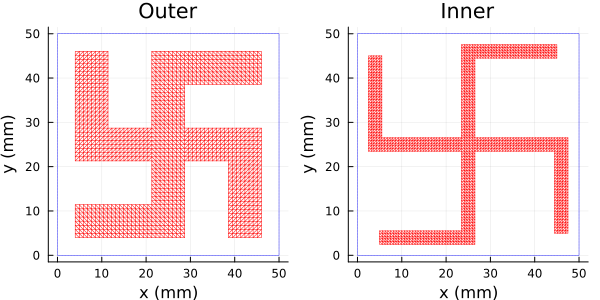

Here is the rest of the script that performs the normal incidence analysis and compares it against
the same analysis performed in HFSS:

```Julia
strata = [Layer()
          outer
          Layer(width=L_paper/2 * 1mm)
          inner
          Layer(width=L_paper/2 * 1mm)
          outer
          Layer()]

flist = range(2.5, 3.5, 300)
steering = (θ=0, ϕ=0)
result = analyze(strata, flist, steering; logfile="ass1_ntri$ntri.log", resultfile="ass1_ntri$ntri.res")

s21db = extract_result(result, @outputs s21db(te,te))

p = plot(xlim=(2.5,3.5),ylim=(-50,0),xticks=2.5:0.1:3.5, minorticks=2,framestyle=:box,
         title="Normal Incidence Transmission", xlabel="Frequency (GHz)", ylabel="20log₁₀|S₂₁| (dB)")
plot!(p, flist, s21db, label="PSSFSS", linewidth=2)

using DelimitedFiles
hfssdat = readdlm("assets/hfss_ass_full.csv", ',', Float64, skipstart=1)
freqhfss = hfssdat[:,1]
s21hfss = hfssdat[:,4]
plot!(p, freqhfss, s21hfss, label="HFSS", linewidth=2)
display(p)
```

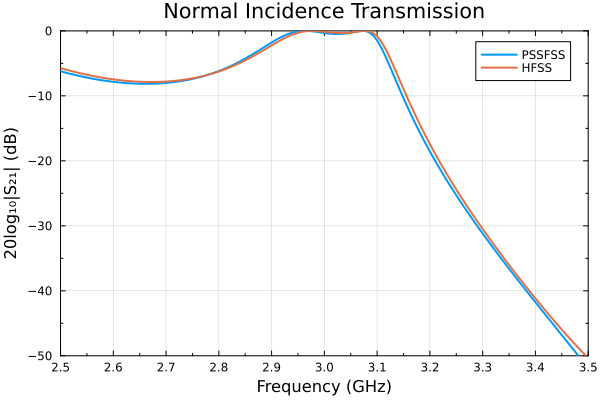

The above run required about 126 seconds on my machine.

Below is the script that analyzes the angle selective surface at 3 GHz while varying the incidence angle:

```Julia
using PSSFSS, Plots

# Dimensions in mm using the paper's notation:
Pₚ=50; Lₚ=115; L1ₚ=24.7; L2ₚ=42; L3ₚ=21.5; L4ₚ=45; W1ₚ=7.4; W2ₚ=3

common_keywords = (units=mm, class='M', w2=0, a=0, s1=[Pₚ, 0], s2=[0, Pₚ], ntri=2500)
outer = manji(; L3=W1ₚ, w=W1ₚ, L1=L1ₚ, L2=L2ₚ/2-W1ₚ, common_keywords...)
inner = manji(; L3=W2ₚ, w=W2ₚ, L1=L3ₚ, L2=L4ₚ/2-W2ₚ, common_keywords...)

strata = [Layer()
          outer
          Layer(width=Lₚ/2 * 1mm)
          inner
          Layer(width=Lₚ/2 * 1mm)
          outer
          Layer()]

flist = 3.0
steering = (θ=0:2:60, ϕ=0)
result = analyze(strata, flist, steering; logfile="ass2.log", resultfile="ass2.res")

s21te, s21tm = eachcol(extract_result(result, @outputs s21db(te,te) s21db(tm,tm)))

(; ϕ, θ) = steering
p = plot(xlim=(0,60),ylim=(-40,0),xticks=0:10:60, yticks=-40:10:0, minorticks=2, framestyle=:box,
         xlabel="Incidence Angle θ (deg)", ylabel="20log₁₀|S₂₁| (dB)",
         title="ϕ = $(ϕ)° Transmission at $flist GHz")
plot!(p, θ, s21te, label="PSSFSS TE", linewidth=2)
plot!(p, θ, s21tm, label="PSSFSS TM", linewidth=2)
display(p)
```

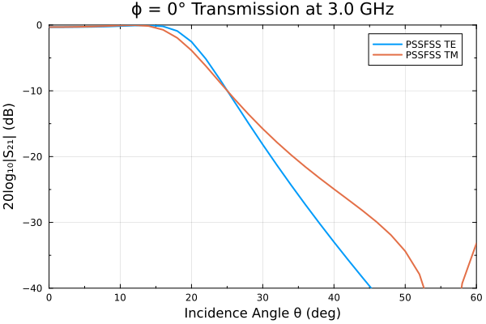

Note how the transmission amplitude rapidly rolls off beyond about 15°.  This run required
about 13.5 minutes to complete, much longer than for normal incidence. This is due to fact that
the incremental phase shift ψ₁ is not held constant during the analysis, requiring the spatial
integrals to be recomputed for each new incidence angle.

```@meta
EditURL = "../literate/checkerboard_example.jl"
```

## Checkerboard Metasurface
Checkerboard-style metasurfaces have been exensively studied, for example in [nakata2013plane](@cite)
and [kempa2010percolation](@cite).  They exhibit some very unusual properties, which we will demonstrate here.

We consider a series of checkerboad-like geometries.  The square unit cell has dimension ``P = 5~\text{mm}``.
The side length for a PEC square sheet rotated 45° and perfectly inscribed in the unit cell is ``L_0 = P / \sqrt{2}``.
We will analyze a series of squares at 1 GHz with side lengths ``L = L_0 + δ``.  The function `computed_and_plot`
defined below will take a given value of ``δ`` as its input, then perform four distinct analyses based on two
complementary triangulations.  Let's run it first for ``δ = -0.5 \text{mm}`` and look
at the resulting triangulations:

````@example checkerboard_example
using PSSFSS, Plots, PrettyTables
using Printf: @sprintf

units = mm
P = 5  # period in x and y direction
L0 = P / √2 # Side length for self-complementary square
Nx = Ny = 10

function compute_and_plot(δ; P=P, units=units, L0=L0, Nx=Nx, Ny=Ny)

    Px = Py = P
    Lx = Ly = L0 - abs(δ)
    orient = 45
    islekwds = (; Lx, Ly, Px, Py, units, Nx, Ny, orient)
    holekwds = (; units, s1=[P,0], s2=[0,P], sides=4,
                  a = iszero(δ) ? [P/2] : [(L0-abs(δ)) / √2],
                  b=[-2*Nx], ntri=2*Nx*Ny, structuredtri=false)
    if δ ≤ 0
        redj = rectstrip(; class='J', islekwds...)
        redm = rectstrip(; class='M', islekwds...)
        bluej = polyring(; class='J', holekwds...)
        bluem = polyring(; class='M', holekwds...)
    else
        redj = polyring(; class='J', holekwds...)
        redm = polyring(; class='M', holekwds...)
        bluej = rectstrip(; class='J', islekwds...)
        bluem = rectstrip(; class='M', islekwds...)
    end

    p1 = plot(redj, unitcell=true, faces=true, fillcolor=:red, title="Unit Cell")
    p2 = plot(redj, faces=true, edges=false, fillcolor=:red, rep=(3,3), title="3×3 Array")
    p3 = plot(bluej, unitcell=true, faces=true, fillcolor=:blue, title="Unit Cell")
    p4 = plot(bluej, faces=true, edges=false, fillcolor=:blue, rep=(3,3), title="3×3 Array")
    pl = plot(p1,p2,p3,p4, layout=(2,2), size=(550,600), plot_title=" Triangulations for δ = $δ")

    flist = 1  # Analysis frequency in GHz
    steering = (θ=0, ϕ=0) # Normal incidence
    logfile = resultfile = devnull  # Suppress creation of output files
    showprogress = false  # Suppress screen output

    redjres = analyze([Layer(), redj, Layer()], flist, steering; logfile, resultfile, showprogress)
    bluejres = analyze([Layer(), bluej, Layer()], flist, steering; logfile, resultfile, showprogress)
    redmres = analyze([Layer(), redm, Layer()], flist, steering; logfile, resultfile, showprogress)
    bluemres = analyze([Layer(), bluem, Layer()], flist, steering; logfile, resultfile, showprogress)


    s11rj = extract_result(redjres, @outputs s11(v,v)) |> only
    s21rj = extract_result(redjres, @outputs s21(v,v)) |> only
    s11rm = extract_result(redmres, @outputs s11(v,v)) |> only
    s21rm = extract_result(redmres, @outputs s21(v,v)) |> only
    s11bj = extract_result(bluejres, @outputs s11(v,v)) |> only
    s21bj = extract_result(bluejres, @outputs s21(v,v)) |> only
    s11bm = extract_result(bluemres, @outputs s11(v,v)) |> only
    s21bm = extract_result(bluemres, @outputs s21(v,v)) |> only

    return pl, (; s11rj, s21rj, s11rm, s21rm, s11bj, s21bj, s11bm, s21bm)
end

pl, _ = compute_and_plot(-0.5)
pl
````

The function creates a "red" triangulation occupying the triangle of side length ``L_0 + δ``, and a "blue" triangulation,
occupying the complementary portion of the unit cell. Since for this case the red square
side length is 0.5 mm shorter than the critical length ``L_0``, it lies strictly inside the unit cell.  So if we choose to
use the red triangulation to model electric surface current, then we can consider the red regions to be "islands" of
metal in otherwise empty space.  We could also use the blue triangulation to model magnetic surface current, which again would
lead to the conclusion that the small untriangulated squares are conducting patches or "islands" of metalization.
Either of these two choices, when analyzed with PSSFSS, should yield the same values for computed reflection or transmission
coefficients (within modeling accuracy).

A different approach would be to choose the red triangulation for representing magnetic surface current, in which case
the small red squares would represent "holes" in an otherwise solid metallic sheet. The same "hole" interpretation would
follow from using the blue triangulation to represent electric surface current. In fact, for this case, the blue region
in the full plane can be regarded as the union of an infinite number of metallic squares of dimension ``L_0 + δ``.
So positive values of ``δ`` can be handled by using ``-δ`` and reversing the roles of the red and blue triangulations.
This is exactly what is done in the function `compute_and_plot` above.

We'll now exercise the function for the set of ``δ`` values ``\{ -0.2, -0.05, 0, 0.05, 0.2 \}``, observing both the plotted
triangulations and the resulting scattering parameter predictions for each of the four modeling choices outlined above.

```julia
δs = [-0.2, -0.05, 0, 0.05, 0.2] # Departure in mm from self-complementary square side length
s11rj, s21rj, s11rm, s21rm, s11bj, s21bj, s11bm, s21bm = (zeros(ComplexF64, length(δs)) for _ in 1:8)
for (i, δ) in pairs(δs)
    plt, r = compute_and_plot(δ)
    s11rj[i] = r.s11rj
    s21rj[i] = r.s21rj
    s11rm[i] = r.s11rm
    s21rm[i] = r.s21rm
    s11bj[i] = r.s11bj
    s21bj[i] = r.s21bj
    s11bm[i] = r.s11bm
    s21bm[i] = r.s21bm
    display(plt)
end
```

.png)

.png)

.png)

.png)

.png)

Let the letter "J" denote use of a triangulation to represent electric surface current and let "M" denote magnetic surface current.
So, e.g. "Blue M" means that the blue triangulation is used to represent magnetic current.  We can make the following observations about
the above plots:

1. The red and blue triangulations alway occupy complementary regions of the unit cell. Then for a given choice
   of ``δ``, PSSFSS analysis of "Blue J" and "Red M" should result identical scattering parameters (apart from modeling errors).
   Likewise analysis of "Red J" and "Blue M" should result in the same scattering parameters.
2. It is well known from Babinet's principle [nakata2013plane](@cite) [tan2012babinet](@cite) that reflection coefficients
   of thin perforated screens are equal to the negative of the transmission coefficients of the complementary structure, provided the
   structures exhibit sufficient rotational symmetry as is the case here.  "Red J" and "Blue J" form such a
   complementary pair, as do "Red M" and "Blue M".
3. All of the ``δ`` values are quite small compared to ``L_0 \approx 3.5355 \text{mm}``.  In particular, the plots for
   ``δ = \pm 0.05`` are almost indistinguishable from the plot for ``δ = 0``.  Therefore, we expect the scattering
   parameters of all of these cases to be nearly equal.
4. For the case of ``δ = 0``, the red and blue regions are both self-complementary. From our earlier considerations, we then
   expect equal reflection and transmission coefficients for any of the choices "Red J", "Blue J", "Red M", or "Blue M".  In
   fact all four of these cases should yield the same values.

The following code generates a summary table showing how well these expectations are satisfied:

```julia
mat = hcat(s11rj, s11bm, -s21rm, -s21bj) |> transpose
row_labels = ["S₁₁: Red J ", "S₁₁: Blue M", "-S₂₁: Red M ", "-S₂₁: Blue J"]
header = (["δ = $δ mm" for δ in δs], ["islands or holes" for δ in δs])
header[2][findfirst(iszero, δs)] = "SC (Self-Complementary)"
formatters = (v,i,j) -> imag(v) > 0 ? @sprintf("%7.4f + %6.4fim", real(v), imag(v)) :
                                      @sprintf("%7.4f - %6.4fim", real(v), -imag(v))
highlighters = Highlighter((data, i, j) -> (j == findfirst(iszero,δs)), crayon"red bold")
pretty_table(mat; header, row_labels, alignment=:c, formatters, highlighters)
```

````@example checkerboard_example
for line in eachline("./assets/checkerboard_prettytable.data"); println(line); end #hide
````

For ``δ < 0`` the results seem reasonable.  In this regime of electrically small metal islands (for Red J and Blue M),
one wouldn't expect much reflection, and that is what is observed.  For ``δ > 0``, the geometry (for Red J and Blue M)
consists of a metal plate with small holes, so one would expect almost total reflection, as observed.  Now consider
how well our above observations are aligned with the computed results...

From observations 1 and 2, the numbers in any one column should all be approximately equal, which they are
except for the center ``δ = 0`` column.  From observation 3 we expect all the entries
in any one row to be nearly equal, but this is not true at all.  In any one row there is a violent jump in
amplitude at or near ``δ = 0``.  Finally, from observation 4 we expect all of the numeric entries for ``δ = 0``
to be approximately equal--which they are most definitely not.  What is going on here?

As discussed in the previously cited references, the idealized model being analyzed for ``δ = 0`` is unphysical.
As ``\delta \rightarrow 0`` the response of the structure does not approach a limit, since the violent jump in
reflection coefficient occurs for arbitrarily small positive and negative excursions from ``L_0``.  Any physically
realizable structure must exhibit continuous dependence on its physical parameters. If one attempts
to approximate this ideal surface in the real world one must use finite thickness and conductivity, so that neighboring
unit cells will intersect all along the thickness of the metal, rather than at a single point, thus destroying the
self-complementary property.  Similarly, finite losses in any real metal preclude self-complementarity.

The same problem observed here for an ideal model of a self-complementary surface arises when analyzing pixelated
structures such as shown in the next example, where adjacent metal pixels
can intersect at only a single point. In that case, using a "Blue M" approach is known to agree with measurements.

```@meta
EditURL = "../literate/sympixels_example.jl"
```

## Pixelated Band Pass Filter
This example of from [hong2021design; Fig. 4a](@cite).  It consists of a single-layer
band-pass filter consisting of many square metallic "pixels", optimized using a special binary
optimizer described in the cited paper.

The geometry for the pixelated filter is created using the [`sympixels`](@ref) function as
show below.

````@example sympixels_example
using PSSFSS, Plots
P = 5.4
units = mm
nrim = 1
halfnint = 26
patternvec = Bool[
    0, 1, 0, 0, 0, 0, 0, 1, 0, 0, 1, 1, 1, 0, 1, 1, 0, 0, 1, 0, 0, 1, 0, 0, 0, 1,
    0, 1, 0, 1, 0, 1, 1, 1, 0, 1, 0, 0, 0, 1, 0, 0, 0, 0, 1, 0, 1, 1, 0, 1, 0,
    1, 0, 0, 0, 0, 1, 0, 1, 0, 0, 0, 1, 1, 0, 0, 1, 0, 1, 1, 1, 1, 0, 0, 1,
    0, 1, 0, 0, 0, 1, 0, 1, 1, 1, 1, 0, 0, 1, 0, 0, 1, 0, 0, 0, 0, 0, 0,
    1, 1, 1, 0, 0, 1, 0, 1, 0, 1, 0, 0, 0, 0, 0, 1, 0, 1, 1, 0, 0, 1,
    1, 0, 1, 1, 1, 0, 1, 0, 1, 0, 1, 1, 1, 0, 0, 1, 1, 0, 1, 0, 1,
    0, 0, 0, 1, 0, 0, 1, 0, 0, 1, 1, 1, 0, 1, 0, 0, 1, 0, 0, 0,
    0, 1, 0, 0, 1, 1, 0, 0, 1, 1, 0, 1, 0, 1, 1, 0, 0, 1, 0,
    1, 0, 1, 0, 0, 0, 0, 0, 0, 0, 0, 1, 1, 0, 0, 0, 1, 1,
    1, 0, 1, 0, 0, 0, 0, 0, 1, 0, 0, 1, 1, 0, 0, 1, 1,
    0, 1, 0, 1, 0, 0, 1, 0, 0, 1, 0, 1, 0, 0, 1, 1,
    1, 1, 0, 1, 1, 1, 1, 1, 0, 0, 1, 1, 1, 0, 0,
    0, 0, 0, 1, 0, 0, 0, 0, 0, 1, 1, 1, 0, 0,
    1, 1, 1, 0, 1, 0, 0, 1, 1, 1, 1, 0, 1,
    1, 1, 1, 1, 1, 0, 0, 1, 1, 0, 1, 1,
    0, 1, 0, 0, 0, 1, 0, 1, 0, 0, 1,
    1, 0, 1, 1, 1, 1, 0, 1, 1, 1,
    0, 1, 0, 0, 0, 1, 0, 0, 0,
    0, 0, 1, 1, 0, 0, 1, 1,
    0, 0, 0, 0, 1, 1, 0,
    1, 0, 0, 1, 0, 0,
    0, 0, 1, 1, 1,
    1, 0, 0, 0,
    0, 0, 1,
    0, 0,
    0]


sheet1 = sympixels(; P, units, nrim, halfnint, patternvec, pdiv=1, class='M')
plot(sheet1, size=(450,450), unitcell=true)
````

As described in the documentation for [`sympixels`](@ref), the `1` entries in `patternvec` above
denote the locations of the metallized pixels.  However, by setting `class = 'M'` above we choose to
triangulate the empty pixel locations, i.e. those that are not occupied by metal.  As discussed in
[Checkerboard Metasurface](@ref), this choice is necessary to avoid spurious results when analyzing
a structure of this type.

Note that the above triangulation is created by forming a square for each triangulated pixel and then
adding a single diagonal.  A finer triangulation is required for an accurate analysis result.  This can
be accomplished by increasing `pdiv` to a value greater than `1`.  Here is the triangulation that results
from `pdiv = 2`:

````@example sympixels_example
sheet2 = sympixels(; P, units, nrim, halfnint, patternvec, pdiv=2, class='M')
plot(sheet2, lw=0.5, size=(450,450), unitcell=true)
````

Now each pixel has been divided into an array of 2×2 squares, each of which receives a diagonal to
form triangles. The code for analyzing the `pdiv = 1` case would look like this:
```Julia
strata = [Layer(), sheet1, Layer(epsr=3.28, tandel=0.007, width=0.05mm), Layer()]
steering = (θ=0, ϕ=0)
flist = range(start=20, stop=36, length=401)
logfile = "bp_filter_pdiv1.log"
resultfile = "bp_filter_pdiv1.res"
results = analyze(strata, flist, steering; logfile, resultfile)
s21db = extract_result(results, @outputs s21db(te,te))
```

Accurately analyzing a structure like this consisting of a huge number of pixels can be become
very expensive (in terms of memory usage and CPU time) very quickly.  For example, the `pdiv = 1`
case generated 3056 basis functions and took about 30 seconds to analyze on a 32 GByte machine.
But the `pdiv = 2` case generated 15,088 unknowns and required 683 seconds of execution time.  It
also failed on the 32 GByte machine due to lack of memory, but was run successfully on a 64 GByte
machine.

Because the analysis in [hong2021design](@cite) used nonzero metal thickness, I ran the zero-thickness
geometry in HFSS to observe the significance of the thickness.  Here is a plot comparing the digitized
results from [hong2021design; Fig. 4a](@cite), with the zero-thickness HFSS analysis and the two
PSSFSS analyses:

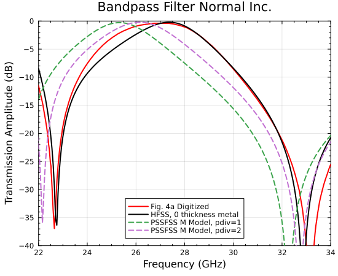

As seen above, the finite metallization thickness does not have a large effect on the transmission trace.
Using `pdiv = 2` produces much better agreement with HFSS, but it appears that an even larger value would
be required to achieve full convergence.

```@meta
EditURL = "../literate/tepfile_creation_example.jl"
```

## TEP File Creation
Here we show how to create a TICRA-compatible TEP (tabulated electrical properties) file using the [`res2tep`](@ref)
function included with PSSFSS. The geometry for this example is a rectangular copper strip measuring
4 cm × 0.2 cm in a 5 cm square unit cell. The code for analyzing this geometry and creating the TEP file is shown below:
```Julia
using PSSFSS
FGHz = 3.0
Px = Py = 5
Lx = 4.0
Ly = 0.2
Nx = 130
Ny = 6
sheet = rectstrip(; Px, Py, Lx, Ly, Nx, Ny, units=cm, sigma=5.7e8)
steering = (θ=0:5:70, ϕ=0:15:345)
strata = [Layer(), sheet, Layer()]
resultfile = "strip.res"
results = analyze(strata, FGHz, steering; resultfile)
res2tep(results, "dipole_pssfss.tep"; name = "dipole", class = "pssfss")
# Alternatively: res2tep(resultfile, "dipole_pssfss.tep"; name = "dipole", class = "pssfss")
```
Note that a very fine discretization has been specified, resulting in 1560 triangles.  There are also a large
number of steering angles requested (15 × 24 = 360).  This analysis required about 155 seconds on my machine.
Please see the documentation for [`res2tep`](@ref) for requirements on setting up analysis scan angles.

For comparison, the same geometry was analyzed using the QUPES program of Ticra Tools Student Edition
2024 (hence the specification for `sigma` above, which is the default conductivity used by QUPES). For the
QUPES analysis, basis function expansion accuracy was set to "Extreme" with the other analysis settings at their
default values.  The maximum magnitude of the difference between QUPES and PSSFSS complex scattering coefficients
for any of these 360 steering angles was approximately 0.0021.  Convergence studies showed that for both codes, the
complex scattering coefficients were still varying slightly in the third decimal place for the settings used in this
example.

```@meta
EditURL = "../literate/fresneltable_creation_example.jl"
```

## Fresnel Table Creation
Here we show how to create an HFSS-compatible Fresnel table using the [`res2fresnel`](@ref)
function included with PSSFSS. The geometry for this example is a double square loop
in a 5 cm square unit cell. The code for analyzing this geometry and creating the
Fresnel table is shown below:
```Julia
using PSSFSS
dwidth = 3mm
duroid = Layer(epsr=2.2, tandel=0.0009, width=dwidth)
a = √2 * [1, 2.125]
b = √2 * [1.5, 3.125]
units = mm
sides = 4
orient = 45
sheet = polyring(;a, b, units, sides, orient, s1=[8,0], s2=[0,8], ntri=2000)
strata = [Layer(), duroid, sheet, duroid, Layer(width=-2*dwidth)]
steering = (θ=0:5:45, ϕ=0)
FGHz = 10:2:20
results = analyze(strata, FGHz, steering; resultfile="double_square_loop.res")
res2fresnel(results, "double_square_loop.rttbl")
# Alternatively: res2fresnel("double_square_loop.res", "double_square_loop.rttbl")
```
Note that the final layer specifies a width that is the negative of the sum of the remaining layers' widths.
This has the effect of moving the output phase reference plane to coincide with the input phase reference plane.
Please see the documentation for [`res2fresnel`](@ref) for discussion of the setup requirements and restrictions
necessary for creating a valid Fresnel table.

